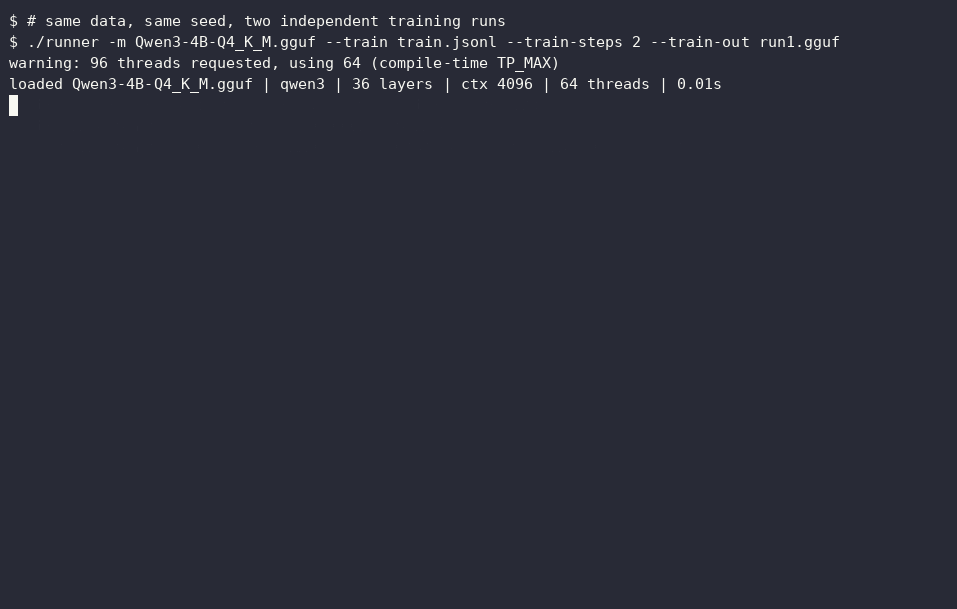
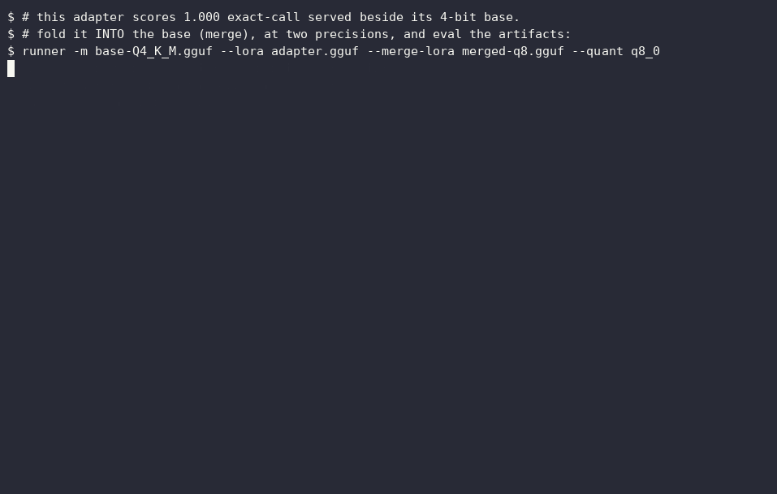

# Xyntetik Runner

One binary is the whole model runtime: it **serves, verifies, scores,
adapts and trains** GGUF models - deterministically, with every claim tied
to a measurement you can re-run. Written from scratch in plain C. No
Python, no pip, no third-party runtime, no ggml. CPU (x86 AVX2/FMA, ARM
NEON), CUDA, and Metal.



## Sixty seconds to a served model

```sh
curl -LO https://github.com/Joakimpalm-Zen/xyntetik-runner/releases/latest/download/runner-macos-arm64
curl -LO https://github.com/Joakimpalm-Zen/xyntetik-runner/releases/latest/download/SHA256SUMS
shasum -a 256 --check --ignore-missing SHA256SUMS
chmod +x runner-macos-arm64 && mv runner-macos-arm64 runner
curl -L -o model.gguf https://huggingface.co/ibm-granite/granite-4.1-3b-GGUF/resolve/main/granite-4.1-3b-Q8_0.gguf
./runner -m model.gguf --serve
```

```sh
curl localhost:8080/v1/chat/completions \
  -d '{"messages":[{"role":"user","content":"Say hello in one sentence."}]}'
```

Linux: the asset is `runner-linux-x86_64` and the check command is
`sha256sum -c --ignore-missing`. Windows: `runner-windows-x86_64.exe`.
The checksum line is not decoration - this project's whole culture is
receipts, and it starts at the download. The model above is the smallest
that passes this project's fidelity gate against its own BF16 parent;
alternatives and the reasoning are in the [quick start](#build-from-source)
below.

macOS note: the binaries are not yet notarized. A `curl` download runs as
shown; a *browser* download gets quarantined by Gatekeeper - clear it with
`xattr -d com.apple.quarantine runner` or right-click → Open once.

**Testing Runner?** The project is pre-1.0 and hardware coverage is still
limited - that is an invitation, not an apology. If you have an
NVIDIA/Apple setup, an unusual GGUF, a coding agent, or a model family
not in the [support matrix](#support-matrix), the result is genuinely
wanted, success or failure alike:
[open an issue](../../issues) with `runner --version`, `runner --caps`,
the model's exact filename and the load log. Independent reproductions
of the determinism claims get credited in the docs, as the first one
already is.

**Contents:** [try it](#sixty-seconds-to-a-served-model) ·
[why Runner](#why-this-and-not-llamacpp) ·
[what it adds](#what-runner-adds) · [training](#adaptation) ·
[models](#models-and-conversion) · [APIs](#serving-and-apis) ·
[support matrix](#support-matrix) ·
[CLI reference](#command-line-reference)

Xyntetik Runner is independent and bootstrapped: **the engine is free
forever under Apache 2.0** - consulting and enterprise work fund the
hardware. Built in Sweden, runs on your hardware; your data never leaves
the building.

## Why this and not llama.cpp?

Use llama.cpp - it is the ecosystem, and Runner deliberately rides its
formats rather than competing with them: GGUF in, llama.cpp-convention
adapter files in *and* out. An adapter Runner trains scores identically
(1.000 on its held-out eval) served by stock llama.cpp, and community F16
adapters load straight back into Runner - both measured, not assumed.

What Runner adds is not a longer feature list; it is a set of
**contracts** the ecosystem does not make. Determinism as a hard promise:
the same executable and inputs reproduce the same sampled tokens across
runs and thread counts, and training reproduces the same adapter file
sha256, gated in CI. Independent rebuilds are explicitly outside that
byte-identity claim because compiler and ISA libm can differ; the full
claim boundary, including everything deliberately NOT promised, is one
page: [docs/determinism-scope.md](docs/determinism-scope.md). Scope as a
promise: supported architectures are
named, unknown ones are refused, and every backend claim is tied to an
executable gate and pinned model evidence. Honesty as an artifact: the
benchmark tables below include the rows where Runner loses, and the docs
keep the failed experiments. If you want maximum architecture coverage and
raw speed, use llama.cpp and we mean that sincerely. If you need to prove
what your model said, what it learned from, or what you actually shipped -
that is what this runtime is for.

### Designed to stay on

There is a cost benchmarks rarely show: what a resident inference server
does to the machine while it serves nothing. We measured it - four-state
lifecycle (loaded idle, post-inference idle, after unload), granite-4.1-3b
Q8_0 at c=4096, stock defaults, engines run sequentially, llama.cpp from
the prebuilt b10639 release. Reproduce it with
[`scripts/idle_coexistence.py`](scripts/idle_coexistence.py).

On an 8 GB M1 (quiet machine), while loaded and idle:

| while idle | runner | llama-server b10639 |
|---|---|---|
| wired (unevictable) memory | +8 MB | +3,819 MB |
| CPU wakeups per second | 0.5 | 161 |
| CPU time per idle minute | ~0.00 s | 0.2-0.3 s |
| give the memory back | `POST /unload` (360 MB to 24 MB) | kill the process |

llama-server wires the whole model into unified memory and holds it until
the process dies, and its idle loop ticks at ~160 Hz. Runner keeps weights
as evictable zero-copy mappings the OS can reclaim whenever another app
needs the RAM, wakes twice per second, and hands everything back on
`/unload` (or automatically with `--ttl`). The flip side is real and we
report it: when llama-server is allowed to hold everything, its time to
first token is faster (0.15 s vs 3.2 s on the pressured M1), because
residency is exactly what it buys. On a discrete-GPU box (RTX 3070) the
footprint gap disappears - both engines hold ~4 GB of VRAM loaded - and
the remaining differences are idle discipline (0.00 vs 0.3-0.6 CPU
seconds per minute) and lifecycle control (`/unload` returned all 4 GB of
VRAM; llama-server has no unload).

These are different optimization goals, not a defect: llama-server is
built to answer the next request as fast as possible, Runner is built to
be left running all day next to your actual work. If the machine is
dedicated to inference, that residency is pure win - use llama.cpp. If
the machine is also your workstation, an engine that wires down half your
RAM and ticks 160 times a second while idle is the reason you kill it
every time - and the reason Runner does not need killing.

The same lifecycle measured on a 128 GB M5 Max with gpt-oss-120b (63 GB)
says abundance does not dissolve the difference, it scales it: loaded idle,
llama-server (`010be968`) wires **+60.8 GB** — half the machine held by an
idle process — against Runner's **+35 MB**, and `/unload` hands everything
back (RSS 229 MB). The latency flip side scales identically: 0.25 s vs 10.1 s
cold first token. Full table and method:
[docs/idle-coexistence-120b-m5max-2026-09-01.md](docs/idle-coexistence-120b-m5max-2026-09-01.md).

For release history and benchmark narratives, see [CHANGELOG.md](CHANGELOG.md)
and [docs/benchmarks.md](docs/benchmarks.md).

<a id="build-from-source"></a>
## Quick start: source builds and model choice

Download a prebuilt binary from the [latest release](../../releases/latest)
for Linux, macOS, or Windows, or build from source:

```sh
git clone https://github.com/Joakimpalm-Zen/xyntetik-runner
cd xyntetik-runner
make
./runner --version   # -> runner 0.4.4
```

CUDA builds and releases need only an NVIDIA driver at runtime. The CUDA
toolkit is needed only by developers regenerating the embedded PTX.

> **GPU driver requirement - raised.** GPU execution now requires an NVIDIA
> driver with **CUDA 13.0 support or newer** (the R580 driver series). The
> embedded PTX is generated by the CUDA 13.0 toolchain (PTX ISA 9.0) to add
> the BF16 and Q2_K device kernels; older drivers - the previous floor was
> the CUDA ~11.8 era - will fail to JIT it, and the runner then reports the
> failure and **falls back to CPU** rather than computing wrong. CPU-only
> execution is unaffected. Check your driver's CUDA level with `nvidia-smi`
> (top-right "CUDA Version").

Release archives name the binary for their platform - `runner-macos-arm64`,
`runner-linux-x86_64`, `runner-windows-x86_64.exe` - so either rename it to
`runner` or substitute that name in the commands below. A source build produces
`runner` directly.

If you have no GGUF handy, the measured recommendation at 8 GB is an
8-bit small model, not a 4-bit larger one. granite-4.1-3b Q8_0 (3.6 GB,
first-party IBM file) is the smallest model that passes this project's
fidelity gate against its own BF16 parent (100% margin-qualified top-1 /
0.0024 mean KLD, 2026-08-14; every 4- and 5-bit quant measured to date
fails on distributional distance):

```sh
curl -L -o model.gguf \
  https://huggingface.co/ibm-granite/granite-4.1-3b-GGUF/resolve/main/granite-4.1-3b-Q8_0.gguf
```

For the fastest possible smoke test on a small machine there is also a
2.63 GB option - know what it is: measured against its own BF16 parent it
agrees on 77.75% of tokens (mean KLD 0.286), a try-the-runner artifact,
not a faithful gemma-4-E2B; its card carries the full numbers.

```sh
curl -L -o model.gguf \
  https://huggingface.co/Joakimpalm-Zen/gemma-4-E2B-it-Q4_0-GGUF/resolve/main/gemma-4-E2B-it-Q4_K_M-Q4_0-mix.gguf
```

Run a GGUF:

```sh
./runner -m model.gguf -i
./runner -m model.gguf -p "Explain prefix caching" --temp 0
./runner -m model.gguf --serve --parallel 2
./runner -m model.gguf -p "Return a status object" --json
./runner -m model.gguf -f big-document.txt -c 8192 -n 200
./runner -m big.gguf --draft small.gguf -p "Continue this code"
```

> **Pre-1.0 (`0.4.4`).** APIs, model coverage and certification envelopes may
> change between releases. CI builds and smoke-tests Linux, macOS, and
> Windows, but the project still has limited hardware coverage. Include
> `runner --version`, `runner --caps`, the model's exact filename, and the load
> log in issue reports. Read [SECURITY.md](SECURITY.md) for the threat model and
> [CONTRIBUTING.md](CONTRIBUTING.md) for the required correctness gates.

## What Runner adds

The contracts above, made concrete. The two capabilities that matter most
have their own sections below; the rest follow as a list, ordered by how
much difference each makes in practice.

<a id="truncation"></a>
### Truncated tool calls that still parse: closing the JSON when `max_tokens` runs out

When a tool call runs past its token budget, most engines return an empty or
malformed `tool_calls` - commonly `finish_reason: "length"` with nothing
usable, or truncated JSON the caller cannot parse and has to repair or retry.
Runner closes the call to the smallest schema-legal document instead, so the
arguments still parse. This is **forced-truncation recovery**, not ordinary
JSON-Schema constrained decoding: once a document starts, Runner emits a legal
ending when the budget expires. On local models, where context is tight and
generation is slow, it is the difference between an agent loop that finishes and
one that retries from scratch - burning tokens, time, and context window.

What each engine hands the caller when the token budget cuts a tool call short
- same box, same tool schema, same prompt, `tool_choice:"required"`,
temperature 0, budgets 1→64:

| engine | budget too small (1–16 tokens) | enough budget (64, control) |
|---|---|---|
| **Runner** | **executable `tool_calls`, arguments parse** | completes |
| vLLM 0.27.1 | no call; protocol framing leaks into `content` | completes |
| llama.cpp b10488 | no call; leak, then `tool_calls` with unparseable args | completes |
| Ollama 0.32.14 | no call; empty content, then HTTP 500 | completes |
| TensorRT-LLM 1.2.1 † | no call; `<tool_call>` leak, then empty content | completes |
| SGLang 0.5.17 † | no call; `<tool_call>` leak, then empty content | completes |

The control rung proves the failure is truncation, not misconfiguration: every
engine completes at 64. Below that, only Runner returns an executable call; the
others each hand back something broken or absent. This is the behaviour across
every OpenAI-compatible engine we have measured - not a claim about engines we
have not. **†** TensorRT-LLM and SGLang were measured on a Qwen3-1.7B substitute
(their model registries did not carry the granite-4.1-3b used for the other
four); truncation recovery is a property of the runtime, so this measures the
engine, not the model.

The [truncation benchmark](docs/truncation-benchmark.md) has the full recipe and
raw responses and pins Runner's column as a per-release regression gate
(`make test-truncation`); the [agent-torture gate](docs/agent-torture.md) tests
the same failure mode. Tool-call fidelity under **quantization** is measured
too: on a full quant ladder, constrained decoding held schema conformance and
tool selection at 100% down to Q4_0 while argument agreement decayed to 50% - it
guarantees the SHAPE of a call at any quantization, not its contents
([docs/quant-fidelity.md](docs/quant-fidelity.md)).

<a id="adaptation"></a>
### Train the GGUF you actually serve

Runner trains LoRA adapters **directly through the frozen quantized GGUF
used for inference**. There is no FP16 training copy and no separate
training framework: the serving forward pass is the training forward pass,
so **the policy you sample is the policy you train** - the train/infer
numerical mismatch that silently breaks on-policy learning cannot occur
between two codepaths that are one codepath. And training is deterministic
in the strongest sense: same data + same seed + same config produce a
**byte-identical adapter file**, with a machine-written provenance record
(base/data/adapter sha256s, seed, full config) beside every adapter -
adaptation as an auditable artifact, not a run that is merely repeatable
"within tolerance."

Measured, on a public artifact you can download and reproduce
([Qwen3-4B-Runner-ToolUse-Q4_K_M](https://huggingface.co/Joakimpalm-Zen/Qwen3-4B-Runner-ToolUse-Q4_K_M)):

| | measured result |
|---|---|
| base | Qwen3-4B **Q4_K_M** (frozen 4-bit serving weights) |
| training path | directly through the quantized inference artifact, CPU |
| held-out tool-calling, exact call | **0.69 → 1.00** |
| reproducibility | two independent runs → **byte-identical adapter** (same sha256) |
| precision study | adapters trained through BF16 vs Q8_0: cosine 0.9998; through Q4_K_M: 0.9926 - measurably different objects, capability-equivalent **on this task's supervised decisions** (on the gold-completion region they coincide to ~0.0003 nat; the divergence lives in the unsupervised prompt region). Not equivalent everywhere: an external 36-prompt boundary bank found a tight-margin case where BF16 and Q8 pick `read_file` and Q4 picks `none`. One case, non-monotonic in bit width, [written up in full](docs/adaptation-engine.md) |
| neutral-corpus drift | nll/token 4.063 → 4.026 (the adapter leaves unrelated text alone) |
| merge study | `--merge-lora` into Q8_0/F16 keeps the 1.00 (verified in stock llama.cpp); merging into the 4-bit base **erases the fine-tune** - 0.69 again, 98.55% of weight bytes round back to the base's codes. Scale sweep: survival is monotone in delta magnitude (erased through 2×, partial at 4×, full at 8× - where the *exact* 8× adapter breaks the served model, the 4-bit grid filters it back to 1.00) |
| interop | the adapter scores the same 1.00 served by stock llama.cpp; community F16 adapters load back into runner (measured on a third-party adapter, which also found and fixed the F32-only loader gap) |



`--score` gives teacher-forced logprobs for evals and rewards, `--lora`
serves any adapter back, `--merge-lora` folds an adapter into the base for
a standalone GGUF any runtime can serve (with its own provenance record -
and the honest caveat that a quantized merge rounds the delta; `--lora` is
the exact form), and `scripts/train-grpo-lite.py` closes the loop into
seeded, replayable reinforcement fine-tuning. Design, gates, failure
modes and every number above: [docs/adaptation-engine.md](docs/adaptation-engine.md).

The rest of what sets Runner apart, ordered by how much difference each makes:

- **A shared GPU stops being first-come, first-crash.** Run a coding agent
  beside an embeddings model beside a draft model and the usual outcome is that
  one load kills another. Runner processes on the same GPU share a VRAM
  registry: a refused load names every live holder by PID, model, bytes, and
  uptime, `--wait-for-vram` turns that refusal into a bounded queue, and records
  left by dead processes are reaped. It makes a GPU something you can schedule
  rather than something you hope fits.
- **You can ask what fits before loading anything.** The usual way to find out
  whether a model fits is to load it and wait for the failure. `--caps` needs no
  model file and returns one JSON document containing live RAM/VRAM, backend and
  GPU limits, CPU and GPU quant lists, admitted architectures, placement modes,
  and model-count limits. A supervisor, tray controller, or CI job can reject an
  incompatible placement before dispatch, which removes a whole class of
  load-wait-fail-retry loops. For a specific file, `--fit` answers the same
  question from the model's GGUF header - the first few megabytes - so a ranged
  read decides whether the rest of the download is worth starting.
- **Constrained decisions come with a confidence signal.** `choice_logprobs`
  records each JSON-schema branch as legal alternatives, a posterior
  renormalized over them, and the probed probability mass - how confident the
  model was choosing one branch over another, which is what routing and
  calibrated classification actually need. The included calibration tool turns
  labeled decisions into accuracy, Brier-score, and ECE gates. This is a
  decision record rather than ordinary token logprobs, and a power-user feature:
  most workloads will never reach for it.
- **A hardware switch has a correctness contract.** If you move a workload
  between backends and the output quietly changes, that is a bug, not a tuning
  artifact. CPU/GPU identity here belongs to an exact SHA-256-pinned model and
  execution path, and faster kernels that reassociate floating-point sums must
  pass numerical tolerance gates rather than inherit a correctness claim from the
  backend name. Most users never compare outputs across backends; this is
  documented because the project treats correctness as a gate, not because it is
  a headline.

The full compatibility method is in
[docs/compatibility-program.md](docs/compatibility-program.md) and performance
measurements are in [docs/performance.md](docs/performance.md). Work that was
built, measured and rejected is kept too, so it is not attempted twice:
[docs/negative-result-expert-cache.md](docs/negative-result-expert-cache.md)
for MoE expert caching, and
[docs/negative-result-metal-multirow-matvec.md](docs/negative-result-metal-multirow-matvec.md)
for the multi-row Metal decode matvec - which also records what the
CPU/GPU byte-identity contract costs in reachable GPU optimizations.

## Build and platforms

```sh
make          # release build: ./runner or runner.exe
make debug    # ASan/UBSan development build where supported
make test     # unit, fixture, generated-source, and backend gates
```

Runner uses ordinary platform C, math, threading, mmap/file-mapping, and
dynamic-loader libraries. GGUF is little-endian, so little-endian hosts are
required.

| Platform | Toolchain | Accelerated path |
|---|---|---|
| Linux x86_64 | GCC | AVX2/FMA; CUDA on NVIDIA Turing / compute capability 7.5 or newer, driver with CUDA 13.0+ support (R580 series) |
| macOS arm64 | Apple Clang | ARM NEON; Metal on Apple Silicon |
| Windows x86_64 | MinGW-w64 via MSYS2 | AVX2/FMA; CUDA on NVIDIA Turing / compute capability 7.5 or newer, driver with CUDA 13.0+ support (R580 series) |

On Windows, install `make` and `mingw-w64-ucrt-x86_64-gcc` from an MSYS2 UCRT64
shell, then run `make`.

### Container image

Each release publishes a CPU image - the same binary on a distroless glibc base,
nothing else - to `ghcr.io/joakimpalm-zen/xyntetik-runner:<version>` (and
`:latest`). Build it yourself with `docker build -t runner .`.

The server binds **loopback only** by design (there is no `--host`/`0.0.0.0`
flag), so it never exposes itself to a network, even in a container - which
shapes how you run it:

```sh
# One-shot inference (no networking):
docker run --rm -v "$PWD/models:/models" \
  ghcr.io/joakimpalm-zen/xyntetik-runner:latest \
  -m /models/your.gguf -p "hello" -n 128 --gpu off

# Serve on the host's localhost (Linux; --network host shares the host loopback,
# so the loopback-only server is reachable at 127.0.0.1:8080 on the host only):
docker run --rm --network host -v "$PWD/models:/models" \
  ghcr.io/joakimpalm-zen/xyntetik-runner:latest \
  -m /models/your.gguf --serve --port 8080
```

`-p 8080:8080` does not work - the port-proxy cannot reach a server bound to the
container's own loopback; use `--network host`. There is no auth boundary, so
keep any deployment on a trusted host.

The image is **CPU by default, but GPU-capable without a separate variant.** The
binary loads the CUDA **driver** at runtime (`libcuda.so.1`, the driver API) and
carries its kernels as embedded PTX, so it needs no CUDA toolkit baked in - run
it on an NVIDIA host with the NVIDIA Container Toolkit and `--gpus all` and the
runner uses the GPU:

```sh
docker run --rm --gpus all --network host -v "$PWD/models:/models" \
  ghcr.io/joakimpalm-zen/xyntetik-runner:latest \
  -m /models/your.gguf --serve --port 8080
```

(A `nvidia/cuda`-based image is deliberately not published - it would only add a
CUDA runtime the driver-API path never calls.) Verified on an RTX 3070 via WSL2
(2026-08-19, Docker 29.1.3 + NVIDIA Container Toolkit 1.19.1): the same
distroless image run with `--gpus all` reports `"gpu":{"backend":"cuda","name":
"NVIDIA GeForce RTX 3070",…}` from `runner --caps` and prints `gpu: CUDA backend
on NVIDIA GeForce RTX 3070` with VRAM accounting at load; the identical image run
without `--gpus` reports `"gpu":null` and runs on CPU (`libcuda.so.1` absent), so
the flag is what makes the difference. A generation attempt in that case says
that the CUDA driver library is unavailable before continuing on the CPU;
runtime/device discovery and backend staging failures likewise name the failed
stage instead of looking like a successful GPU admission. CUDA shared-weight
setup also identifies the tensor upload or per-layer table/field that failed,
including architecture-specific recurrent, sink, MoE-bias, and Gemma tables.
Metal cannot be containerized
(Apple-Silicon only, no passthrough).

## Models and conversion

Runner accepts GGUF v2/v3. Safetensors checkpoints must be converted to GGUF
first. Standard llama.cpp multi-part sets (`<prefix>-00001-of-000NN.gguf`) load
natively from any part: every part must be present in the same directory, and
its `split.no`, `split.count`, and `split.tensors.count` metadata must agree.
Missing or inconsistent parts are refused before model binding. Nonstandard
filenames and remote/streamed parts are not resolved automatically; merge or
rename those sets to the standard layout first.

Fetch the small test model with:

```sh
./download-model.sh
```

For manual downloads, verify both the command exit status and resulting byte
size. A partially downloaded GGUF can otherwise look like a model failure.

### Requantization and expert pruning

Repack weight matrices to `q8_0`, `q4_0`, or `f16`:

```sh
./runner -m model-f16.gguf --quantize model-q4.gguf --quant q4_0
```

Norms, biases, and rope factors stay f32; tensors already smaller than the
target are retained, as are rows the target type cannot describe (`q3_k` needs
a row width divisible by 256, `q8_0`/`q4_0` by 32). MoE router weights
(`ffn_gate_inp*`) keep their source type on every path, including a
`--type-plan` that names them: the router selects which expert runs, so an
error there swaps a whole FFN, and it is a fraction of a percent of the file.
Metadata is copied.

A `q4_0` repack is **lossless where the source is already on the q4_0 grid**,
which is the case for quantization-aware-trained checkpoints: every value is
one per-block scale times an integer code, so the answer is already in the
file. Runner recovers that scale and those codes exactly instead of
re-deriving a scale from the block's extreme value - the derived route is
correct only when a block's codes actually reach zero, and on a block where
they do not it saturates the far end of the range and changes values a pure
repack had no need to touch. A candidate is accepted only when the value the
dequantizer will produce equals the source float bit for bit across the whole
block, so a source that is not on a grid falls through to the derived scale
and its output is byte-for-byte what it was before.

`--prune-experts` rewrites stacked-layout MoE tensors using an explicit JSON
plan. It is a mechanism, not a quality claim: pruning needs a model-specific
evaluation against the unpruned parent.

```json
{"layer_0":[0,3,7],"layer_1":[1,2,5]}
```

```sh
# Prune only; surviving tensors keep their current quant type.
./runner -m model.gguf --quantize pruned.gguf --prune-experts keep.json

# Prune and requantize the survivors.
./runner -m model.gguf --quantize pruned-q4.gguf \
  --prune-experts keep.json --quant q4_0
```

A layer omitted from the plan keeps all experts. Invalid keys, empty lists,
out-of-range IDs, and unsupported tensor layouts fail instead of silently
producing a different model. The layer's router (`ffn_gate_inp`) and its
per-expert selection bias (`exp_probs_b`, in either on-disk spelling - the
`.weight` of the DeepSeek-style GGUFs and the `.bias` of `nemotron_h_moe`) are
sliced along with the expert banks, so the survivors in plan order become the
new expert index space with no runtime remapping. Non-uniform coverage-pruned
`nemotron_h_moe` layers resolve their expert count from each layer's router and
run on CPU; CUDA names and declines this layout because its MoE kernels require
one model-wide expert count.
`scripts/moe-prune-plan.py` can build a plan from calibration data.

**A non-uniform prune produces a file that is correct in Runner and not
portable, and an artifact built that way has to say so.** GGUF carries ONE
`<arch>.expert_count` for the whole model and has no per-layer field. When a
plan leaves every MoE layer at the same new count, that key is rewritten and
the file describes itself completely. When a plan prunes layers to different
counts, or leaves some layers unpruned, no single value can describe it: the
key is deliberately left at the parent's number, which remains every layer's
true ceiling but is no longer tight for the pruned ones. Runner loads such a
file correctly because it resolves each layer's real expert count from that
layer's own router tensor rather than from the global key. **An engine that
trusts the global key will not.** So a published artifact from a non-uniform
prune must state that it is Runner-correct and untested elsewhere, in the same
place it states its fidelity; a uniform prune carries no such caveat. This is a
format gap, not a defect in either engine, and closing it needs a per-layer
expert-count convention that GGUF does not currently define.

### Published artifacts

Artifacts produced by this project are published only after their stated gate
against the named parent. Read each repository's provenance before treating a
derivative as equivalent to an original checkpoint.

Every fidelity claim below is measured under the adopted dual-column bar
(margin-qualified top-1 >= 97% AND mean KLD <= 0.05 vs the named parent,
400 teacher-forced positions, zero point exact; plain top-1 always
reported beside it).

- [Qwen3-30B-A3B selective precision](https://huggingface.co/Joakimpalm-Zen/Qwen3-30B-A3B-selective-attnQ8_0-expQ4_0-GGUF)
  (attention Q8_0 / experts Q4_0, 17.99 GB) **passes the bar** where the
  official uniform Q4_K_M fails it, from a byte-verified first-party Q8_0
  source. Built with `--type-plan`; the exact plan is on the card. The
  artifact class this project now leads with.
- [Qwen3-Coder-30B keep-120](https://huggingface.co/Joakimpalm-Zen/Qwen3-Coder-30B-A3B-Instruct-keep120-Q4_K_M-GGUF)
  (expert-pruned, 17.5 GB) **passes both the original and the current
  bar** - the only published artifact to clear the original bar unaided.
- [gpt-oss-20b-keep30-MXFP4](https://huggingface.co/Joakimpalm-Zen/gpt-oss-20b-keep30-MXFP4-GGUF)
  (11.5 GB, 32-to-30-expert derivative) **does not pass the current
  bar**; its originally published number did not reproduce and the card
  leads with the measured status. Kept published as a near-miss with its
  numbers in the open.
- [gemma-4-E2B-it Q4_K_M/Q4_0 mix](https://huggingface.co/Joakimpalm-Zen/gemma-4-E2B-it-Q4_0-GGUF)
  (2.63 GB) is the smoke-test artifact from the quickstart: fails the
  fidelity bar (the card carries the dual-column numbers) and remains the
  fastest way to try the runner on an 8 GB machine.
- [NVIDIA-Nemotron-Nano-9B-v2 Q8_0](https://huggingface.co/Joakimpalm-Zen/NVIDIA-Nemotron-Nano-9B-v2-Q8_0-GGUF)
  (8.81 GB) is not a bar-gated derivative but the first **Mamba-2 hybrid
  (`nemotron_h`)** artifact the runner supports - a plain, near-lossless Q8_0 of
  NVIDIA's base, quantised by the runner's own canonical (ggml-byte-identical)
  quantiser and verified **5/6 greedy token-identical vs llama.cpp b10353 at Q8_0**
  (the sole miss a quant-noise near-tie). NVIDIA Open Model License; the card leads
  with the tool-calling differentiator.
- Measurement reports over third-party artifacts, no weights republished,
  every measured file bound by SHA:
  [Hermes-4-14B quant fidelity](https://huggingface.co/Joakimpalm-Zen/Hermes-4-14B-quant-fidelity-report)
  (the 4-bit size threshold and the split story), the
  [Qwen3 speculative pair](https://huggingface.co/Joakimpalm-Zen/Qwen3-speculative-pair-report)
  (measured draft acceptance, and why the engine's printed tok/round must
  not be tuned on), and the two Mamba-2 hybrid support reports -
  [granite-4.0-h-small](https://huggingface.co/Joakimpalm-Zen/granite-4.0-h-small-runner-report)
  (`granitehybrid`, 3/5 greedy-identity at the noise floor) and
  [Nemotron-3.5-Lightning-30B-A3B](https://huggingface.co/Joakimpalm-Zen/Nemotron-3.5-Lightning-30B-A3B-runner-report)
  (`nemotron_h_moe`, 4/5) - each carrying its measured-envelope manifest. Two
  frontier reports (2026-08-20, no weights republished - nothing cleared the
  bar AND beat upstream): the
  [Lightning-30B prune frontier](https://huggingface.co/Joakimpalm-Zen/Nemotron-3.5-Lightning-30B-A3B-prune-frontier-report)
  (keep-126 passes at 99.50%/0.026; the plan is published, the 1.37% saving was
  not worth an artifact) and the
  [Muse-Glimmer-30B quant frontier](https://huggingface.co/Joakimpalm-Zen/Muse-Glimmer-30B-runner-quant-frontier-report)
  (Meta's own Q4_K_M passes the bar; six runner plans measured, none beat it -
  stated openly).

## Command-line reference

`runner --help` remains authoritative for the binary being executed. This
grouped reference makes the complete interface discoverable without mixing
flags into unrelated feature sections.

### Modes and input

| Option | Purpose |
|---|---|
| `-m PATH` | GGUF path. In serve mode, `name=path,name2=path2` enables multi-model swap mode. |
| `-p TEXT` | One-shot prompt; escaped sequences such as `\n` are unescaped. |
| `-f FILE` | Append file contents to the prompt. |
| `-i` | Stateful interactive chat. |
| `--serve` | Start the HTTP server. |
| `--tray` | Be the macOS/Windows tray controller instead of running a model. Required where there is no terminal. See [Desktop tray](#desktop-tray). |
| `--no-tray` | Opt out of the tray everywhere, including the one that otherwise follows `--serve` and `-i`. |
| `--port N` | Server port, default `8080`. |
| `--parallel N` | Independent inference slots for a single-model server, default `1`. On CUDA and (since 2026-09-01) Metal, ready slots decode as one microbatch sharing a single weight sweep per step — measured 1.45-1.47x aggregate decode at 4-8 slots on Metal/M5 Max, and **bit-identical to sequential decode** by twin-kernel construction, gated in `make test` (`test-batch-identity`). Dense models only; MoE/recurrent families decode sequentially. `RUNNER_METAL_BATCH=0` restores sequential on Metal. |
| `--ttl N` | Swap-mode idle unload timeout, default `300`; `0` disables it. |
| `--force-uncertified` | Load a model even when its measured-envelope sidecar records an `outside-envelope` verdict for this runtime (refused by default). See [Measured-envelope gate](#measured-envelope-gate). |
| `--json` | Constrain output to one valid JSON object. |
| `--json-schema FILE` | Constrain output to the schema in `FILE`. |

### Generation and context

| Option | Purpose |
|---|---|
| `-n N` | Maximum generated tokens, default `256`; `-1` runs until EOS. |
| `-c N` | Context length; default is the smaller of model maximum and 4096. `0` auto-fits with a reservation. |
| `-b N` | Prompt batch size, default `64`. Unless `--gpu off` was given, the default is sized from **total** RAM instead: `512` at 12 GB or more, `256` at 6 GB or more, `64` below — so the tiled prefill GEMM gets more columns per dispatch (measured on Metal/M1: +9% prompt tok/s at 512 over the flat 64 default). Total RAM rather than free RAM on purpose: batch size changes how reassociating prefill paths tile their sums, and a default read off the machine's ambient load would make "the same command" produce different tokens on a busy day. A fixed machine fact cannot. `-b` always overrides. |
| `-t N` | Worker threads; defaults to physical cores and is capped at `32`. The cap is measured, not assumed: decode PEAKS at 32 threads and regresses above it on many-core hardware (a 64-core Zen 5 box in 2026-08, and a 128-core sweep in 2026-08 where both models peaked at 32 while the previous default of 64 cost up to -41% decode and -55% prefill). Only machines with more than 64 logical CPUs are affected; below that the default is unchanged. An explicit `-t` is honoured up to 64. |
| `-s N` | RNG seed; default is time-based. `0` is refused: it is the sampler RNG's fixed point, so it cannot produce a stream. |
| `--think` / `--no-think` | In interactive chat (`-i`), request the model family's thinking or non-thinking prompt shape. They are refused in raw one-shot and server modes rather than being silently ignored; server callers use the request-level `enable_thinking` field. With neither flag, Runner renders whatever that family's own reference template renders, which is not the same answer for every family. Families without a distinct thinking prompt accept the flag and ignore it rather than approximate one. |
| `--temp F` | Temperature; `0` is greedy and disables repeat penalty. |
| `--top-k N` | Top-k sampling; `0` disables it. Several presets ship `0`, where setting it is a measured decode-throughput win that also changes the sampled distribution - see [`--top-k 40`](#--top-k-40-a-faster-constrained-decode-with-different-semantics). |
| `--top-p F` | Nucleus sampling threshold. |
| `--min-p F` | Probability floor relative to the top candidate; `0` disables it. |
| `--repeat-penalty F` | Recent-token penalty; `1` disables it. |
| `--rope-scale F` | Force linear rope position scaling. |
| `--rope-base F` | Override the rope frequency base. |
| `--system TEXT` | System prompt in interactive chat (`-i`) only; refused in raw one-shot and server modes. |
| `--chat-template NAME` | Force `chatml`, `chatml-think`, `llama2`, `llama3`, `mistral`, `mistral-v1`, `mistral-nemo`, `zephyr`, `phi3`, `gemma`, `gemma4`, `gemma4-mainline`, `apertus`, `ornith`, `muse`, `granite`, `harmony`, or `raw`; default is auto-detection. The three Mistral framings are not interchangeable: `mistral` is the v0.3 / Mistral-Small-2409 form and the fallback for an unrecognised Mistral template, `mistral-v1` is v0.1/v0.2, `mistral-nemo` is Nemo-Instruct-2407. They differ by a space beside each `[INST]`/`[/INST]` marker and by which user turn carries the system prompt - one SentencePiece token per divergent space. gemma-4 likewise ships two chat-template revisions that auto-detect and are byte-exact to their own reference: `gemma4` is the E-series (E2B/E4B) form, `gemma4-mainline` is the 12B/26B-A4B/31B form, which pre-seeds an empty thought block on the thinking-off generation prompt where the E-series pre-seeds nothing. Applies to interactive chat and to `--serve`, including reloads after `/unload` or a `--ttl` expiry. An unrecognized name is an error, and the flag is refused with a swap set (`-m "name=path,name2=path2"`) because it names one template for a set of models that each detect their own - serve that model on its own instance instead. |
| `--no-bos` | Do not add the beginning-of-sequence token. |
| `--ignore-eos` | Continue generation past end-of-text tokens. |

### Placement and memory

| Option | Purpose |
|---|---|
| `--gpu auto\|off` | Auto-detect offload, or force CPU. |
| `--gpu-layers N` | Force the first `N` layers onto the GPU; `0` means no GPU. Omit for auto-fit. On Metal it also overrides the residency veto: a model larger than available RAM is refused for auto-selected partial offload, because nothing pinned can be held resident and the measured result was 8-35x slower decode, but an explicit `--gpu-layers N` splits it anyway. |
| `--cpu-moe [N\|auto]` | CUDA hybrid placement: keep all, the deepest `N`, or an auto-fit set of expert FFNs in system RAM. |
| `--wait-for-vram [S]` | Wait for another registered runner to release VRAM, default `300` seconds, instead of failing immediately. |
| `--vram-priority N` | Advisory priority tag on this claim, default `0` (also `RUNNER_VRAM_PRIORITY`). See [VRAM registry: priority and cooperative yield](#vram-registry-priority-and-cooperative-yield). |
| `--yield-on-request` | In `--serve`, release the resident model at the next idle point when another process has asked it to. See the same section. |
| `--reserve P` | Limit this process to `P` percent of total RAM and VRAM. |
| `--reserve-vram P` | Override only the VRAM budget. |
| `--reserve-ram P` | Override only the RAM budget. |
| `--reserve-cpu P` | Size the default thread count as a percentage of cores. |
| `--kv f16\|q8` | KV storage; f16 is default, q8 uses about 53% as much memory and is lossy. |
| `--mlock` | Ask the OS to wire mapped weights into RAM; failure is non-fatal. |
| `--moe-prefetch on\|off\|auto` | Prefetch routed expert blocks. Auto enables it only for measured oversubscribed Apple Silicon cases. |
| `--draft PATH` | Same-vocabulary draft GGUF for speculative decoding in one-shot, chat, or single-model serve mode. A draft is refused at load on a vocabulary mismatch, a fully GPU-offloaded target, a CUDA-resident recurrent state, or out of memory, and is dropped in swap mode; the run continues without it. In serve mode `GET /v1/capabilities` reports whether the draft is actually `active`, so a harness never measures the fallback as speculative decoding. |
| `--draft-k N` | Draft tokens per speculative round, default `4`. |
| `--draft-required` | Fail the run instead of decoding plain when `--draft` is refused. The drop is deliberate and stays the default, but in local one-shot and interactive modes it is announced only on stderr beside a zero exit, so automation that collects stdout and checks the return code can record an unaccelerated run as speculative decoding. This flag closes that hole for benchmarks and scripted chat; it needs `--draft`, and it is refused in serve mode rather than accepted with no effect, because `GET /v1/capabilities` already reports whether the draft is `active` there. |

### Conversion, diagnostics, and integration

| Option | Purpose |
|---|---|
| `--quantize OUT` | Rewrite the loaded model to `OUT` and exit. |
| `--quant q8_0\|q4_0\|q3_k\|q4_k\|q6_k\|f16\|bf16\|keep` | Requantization target; default `q4_0`, or keep per-tensor types when pruning or merging alone. Requires `--quantize` or `--merge-lora`; without either the flag is refused rather than ignored. |
| `--type-plan PLAN.json` | Per-tensor rewrite plan. First substring rule wins; types are `keep`, `q8_0`, `q4_0`, `q3_k`, `q4_k`, `q6_k`, `f16`, and `bf16`. Example: `{"default":"keep","rules":[{"match":"_exps.weight","type":"q3_k"}]}`. Requires `--quantize`. A rule that cannot be honoured for a tensor - the type's block does not divide the row width, or it would not make the tensor smaller - leaves that tensor at its source type and is reported on stderr BY NAME with the type it asked for, so the built file can differ from the plan as written. `scripts/type-plan-size.py` predicts the exact size and per-type histogram, including declines, before you build. |
| `--merge-lora OUT` | Fold `--lora` into the base weights and write a standalone GGUF that runs in any GGUF runtime: `W' = W + (alpha/r)·B·A` per adapted projection, each tensor requantized to its own type (or `--quant T`), untouched tensors copied byte-verbatim, `OUT.merge.json` provenance (base/adapter/merged sha256s) written beside it. Deterministic: same inputs, byte-identical merged file. Merging into a quantized type rounds the delta through that type's grid - the merged artifact's fidelity is a measurement, not a given; `base + --lora` remains the exact form. |
| `--prune-experts FILE` | Apply a per-layer MoE expert keep-list while rewriting. Requires `--quantize`. |
| `--bench-json` | Run the built-in prompt/decode benchmark and print JSON metrics. |
| `--lora FILE`, `--lora-scale F` | Load a LoRA adapter GGUF beside the frozen quantized base (llama.cpp adapter naming: `blk.N.<proj>.weight.lora_a/_b` + `adapter.lora.alpha`; F32, F16 or BF16 tensors - F16 is what llama.cpp's `convert_lora_to_gguf` emits, and a community adapter in that format loads and serves, measured). Interop runs the other way too: an adapter runner trained scores identically (1.000 on its held-out eval) when served by stock llama.cpp. Applied as `y += scale·B(Ax)` on the CPU dense projections (attention q/k/v/output, FFN gate/up/down) - the base weights and kernels are untouched, so every base identity gate still describes the adapted run's substrate. Fails closed by name on shape/rank mismatches, unknown targets, recurrent/gemma-4-MoE architectures, and GPU-resident models (CPU-only for now). A zero adapter is gated byte-identical to the bare base; a real adapter is gated against the merged-weights reference. The adapter id joins the engine's model identity, so cached prefixes never cross an adapter boundary. |
| `--train FILE`, `--train-steps`, `--lr`, `--train-ctx`, `--train-out`, `--save-every`, `--lora-rank` | AdamW LoRA training in the serving binary (CPU path, position-batched and threaded under a byte-exact contract - 4B trains at ~20 s/step on a many-core host, 2.3× over the first release, with the adapter bytes gated invariant across binaries, thread counts and the optional `RUNNER_TRAIN_GPU=1` CUDA assist): plain-text corpora or `.jsonl` lines `{"prompt","completion","weight"}` with the prompt masked from the loss and per-example weights (the policy-gradient hook `scripts/train-grpo-lite.py` drives). Fresh adapters start as an exact no-op (A seeded, B zero); checkpoints are adapter GGUFs that `--lora` loads back. Deterministic by default: same data + same seed produce a byte-identical adapter file, gated in `make test`. Design, gates and measured results: [docs/adaptation-engine.md](docs/adaptation-engine.md). |
| `--score` | Teacher-forced scoring: per-token log P(token\|prefix) over the raw `-p`/`-f` text - no template, no sampling - printed as JSON (`xyntetik.runner.score.v1`) with per-position logprobs, NLL, perplexity, and the absolute next-token `top1`/`top1_rate` beside `n_vocab`. The default path scores one forward per position, the exact numerics the sampler sees at decode time; `RUNNER_SCORE_CHUNKED=1` opts into a faster batched pass whose deviation from solo is measured and test-pinned (max \|Δlogprob\| ~1e-6 on the fixtures - the CPU batched forward is not bit-identical to solo, and scoring defaults to exactness over speed). `top1` exists so a harness can check the run instead of trusting it: a token with probability above 0.5 must be the argmax and an argmax token must carry at least `1/n_vocab`, so the reported count is bracketed by the reported logprobs, and a scorer that disagrees with itself fails loudly rather than returning a confident wrong perplexity. |
| `--transcript FILE` | Record a one-shot `-p` run as `xyntetik.runner.transcript.v1`: model, adapter and binary hashes; the effective execution profile (including fallback KV type and GPU layer count); the exact 64-bit seed and sampling config; prompt/output text and token ids; the exact streamed output bytes as `output.bytes_hex` (tokenizer pieces need not individually be valid UTF-8); and a chain hash over the serialized record body. |
| `--verify FILE` | Replay a transcript against `-m` and report `VERIFIED` (exit 0), `DIVERGED` at a token or output byte (exit 2), or `UNVERIFIABLE` for an invalid record or artifact mismatch (exit 3). The recorded replay settings override conflicting CLI values. See [the exact determinism scope](docs/determinism-scope.md). |
| `--caps` | Print machine, backend, quant, architecture, placement, and sampling capabilities as JSON. |
| `--tool-info` | With `-m`, print the model's tool-call protocol as JSON (`{"tool_family":…,"native_tool_protocol":…}`) and exit. No manifest required. |
| `--fit PATH` | Estimate whether a GGUF fits this machine and exit. Reads only the header, so a partial download answers the question. |
| `--version` | Print the version and exit. |
| `-h`, `--help` | Print the option reference to stdout and exit `0`. Help asked for is written to stdout; help printed because something went wrong goes to stderr with a non-zero exit. |
| `--parent-pid N` | Exit when process `N` dies; intended for supervisor cleanup. |
| `-v` | Print verbose model and memory information. On a sliding-window model this includes a `kv reachable` line beside `kv cache`: every layer is allocated `n_ctx` rows, but a sliding layer never attends further back than its window, so the rest is written once and never read. The gap is large enough to decide a context length - gemma-3-4b at `-c 32768` allocates 4563 MB and can reach 793 MB of it - and it is a ceiling, not a correctness problem: answers are unaffected, the cache is simply bigger than the model can use. |

#### Deciding before you download

`--fit` answers "will this run here" from a model's GGUF **header**, which is
the first few megabytes of the file:

```console
$ runner --fit Trinity-Nano-Preview-Q4_K_M.gguf
fit: Trinity-Nano-Preview-Q4_K_M.gguf
  model         afmoe, 56 layers, MoE 128 experts, 8 used
  weights       3.53 GiB
  hot set       0.66 GiB  (only the routed experts a token actually uses)
  kv cache      0.22 GiB at ctx 4096, f16   |  0.12 GiB with --kv q8
  available RAM 3.25 GiB right now
  verdict       FITS — 2.37 GiB to spare at ctx 4096
```

The verdict is `FITS`, `FITS WITH --kv q8`, or `PAGES`, always with the
arithmetic that produced it. `-c N` sizes the KV estimate for the context you
actually intend to run. For a sparse MoE the verdict uses the **hot set**, not
the file size, because only the routed experts a token selects are touched -
which is why a 3.53 GiB file can be a comfortable fit in 3.25 GiB.

The runner does not download anything, and `--fit` is not a reason to teach it
HTTP. Fetch a header yourself with a ranged read - 16 MiB covers a large
vocabulary; smaller models need far less:

```sh
curl -r 0-16777215 -L -o head.gguf \
  https://huggingface.co/ORG/REPO/resolve/main/MODEL.gguf
runner --fit head.gguf
```

The sizes reported from a truncated header are the **whole** model's, because
they come from the tensor descriptors rather than from how many bytes arrived.
Loading such a file still fails, as it should: the normal loader refuses a GGUF
whose data section does not cover the tensors it declares, and `--fit` reads
through a separate path rather than relaxing that check.

### Usage behavior

Use chat mode or an API chat surface to judge an instruction-tuned model.
Raw `-p` completion deliberately bypasses chat framing and is primarily useful
for benchmarks and deterministic comparison gates.

Sampling defaults come from a per-family preset selected from model metadata
and filename. The chosen preset is logged at load, `--caps` publishes the full
preset table, and explicit sampling flags always win. At `--temp 0`, runner
returns the model argmax without applying repeat penalty.

Interactive chat keeps its KV state across turns and auto-detects the template
from metadata and vocabulary. Thinking channels are displayed separately.
The server additionally reuses the longest shared prompt prefix across
requests.

On macOS and Windows, a session you sit with - a bare invocation, `--serve`, or
`-i` - also raises the desktop tray, which is left running afterwards. One-shot
`-p` runs, tooling modes, pipes, scripts, CI, and Linux keep text-mode
behavior, and `--no-tray` opts out everywhere. See [Desktop tray](#desktop-tray).

## Runtime and hardware

### CPU and GPU backends

CPU execution has portable scalar kernels plus AVX2/FMA and ARM NEON paths.
`--gpu auto` selects a usable backend and falls back with a reason when a model
layout, tensor type, runtime, or capacity is unsupported.

| Backend | Tensor formats |
|---|---|
| CPU | F32, F16, BF16, Q8_0, Q4_0, Q4_1, Q5_0, Q5_1, Q2_K, Q3_K, Q4_K, Q5_K, Q6_K, IQ4_NL, IQ4_XS, MXFP4 |
| Metal | The full CPU list |
| CUDA | The full CPU list |

`runner --caps` is the live source of truth for a particular executable and
machine. Architecture and MoE layout checks still happen at model load; a
listed tensor kernel does not imply that every architecture using that tensor
is implemented on that backend.

**Metal:** Apple Silicon uses zero-copy mapped weights and unified-memory KV.
Metal supports f16 and q8 KV, dense and selected MoE layouts, and tiled prefill
GEMMs. Full offload is the preferred and default shape. A file above
`gpu.max_working_set_bytes` in `--caps` takes a leading-layer split when the
tensor layout allows a contiguous prefix wrap *and* the whole model still fits
in RAM; when it does not, the backend falls back to CPU rather than split,
because pinning part of a model that does not fit measured 8–35x slower than
CPU-only on an 8 GB M1. `--gpu-layers N` forces a split anyway. Multi-part
(split) GGUF sets take a **full Metal offload**: the weight wraps are keyed by
host address, so each part's mapping gets its own tensor-boundary wraps, and a
2-part 86 GB set measured byte-identical to the single file it was merged
from. What a split set cannot take is a partial **layer** split (`--gpu-layers`
below the layer count), whose prefix arithmetic cannot span separate
mappings — that combination refuses loudly and runs on the CPU, as does a set
whose whole size exceeds the Metal working-set budget. The embedded shader
gate compiles the library and verifies every kernel the backend looks up,
reading that roster out of `src/metal.m` rather than restating it.

On M5-class Macs running macOS 26.2 or newer, `RUNNER_METAL_TENSOR=1` opts
Q4_K prefill into a separately compiled Metal 4 MPP tensor GEMM. Admission
runs a hand-computable 256-wide matrix self-test before any model dispatch;
compile, pipeline, or numeric failure falls back to the established
simdgroup GEMM. The path is deliberately not the default: on the M5 Max gate
it was numerically sound but only matched, rather than beating by the required
1.2x, the existing kernel. M1-M4 never compile or dispatch it and retain the
same default path and performance. `RUNNER_METAL_TENSOR=0` is the explicit pin.

**CUDA:** Linux and Windows use the dynamically loaded driver API and embedded
`sm_75` PTX. **The embedded PTX is built by the CUDA 13.0 toolchain (PTX ISA
9.0), so GPU execution requires a driver with CUDA 13.0 support or newer (the
R580 series)** - see the driver note in the Install section; on an older
driver the runner reports the JIT failure and falls back to CPU. Full and
partial layer offload are supported. Sparse MoE can keep expert FFNs in RAM
with `--cpu-moe` while attention and dense tensors remain on the GPU.
`make ptx` regenerates the embedded header and requires a CUDA toolkit only
for that development step.

Scalar-path CPU/GPU identity is an evidence result, not a property inferred
from a backend name. CUDA tensor-core and Metal tiled prefill kernels
reassociate floating-point sums, so they are promoted by teacher-forced
tolerance tests. CUDA currently promotes Q4_K/Q6_K/Q8_0 on the gated dense
families and Q4_0 on Gemma 4; the latter was bit-identical over 820 tensor-core
dispatches on the real 31B QAT artifact.

On Metal that now covers **decode as well as prefill**: the cooperative KV
attention read was promoted on 2026-08-17 after clearing zero teacher-forced
top-1 flips out of 64 on every local model that reaches it - gemma-4 E2B,
gemma-3-4B, granite-4.1-8B under a layer split, SmolLM2, and the NoPE /
attention-temperature fixtures - in both f16 and q8 KV cache formats, for a
measured +3.0–4.3 % decode across 2.3k–8.1k token spans. So Metal decode at
long context is a tolerance-gated route, not a byte-identical one.

`RUNNER_CUDA_TC=0`, `RUNNER_METAL_MM=0`, `RUNNER_METAL_ATTN_COOP=0` and
`RUNNER_METAL_MOE_MM=0` pin the
byte-identical scalar paths for identity investigations; every CPU-vs-GPU byte
comparison in the test suite sets them. `./test-attn-tol MODEL.gguf` is the
attention gate.
Weights are wrapped zero-copy from the model mmap. A file larger than the
device's `maxBufferLength` - 4.29 GB on an M1, against a 5.73 GB working set -
is wrapped in several buffers instead of being copied or forced into a
CPU/GPU layer split. The cuts fall on tensor boundaries, so no tensor spans two
buffers and output is byte-identical to a single-buffer wrap;
`RUNNER_METAL_MAX_BUF` shrinks the per-buffer ceiling so that path can be
exercised on a machine whose models all fit one buffer, and
`make test-metal-multibuf` is the byte-identity gate. A separate pure admission
gate simulates a file above `maxBufferLength` but below the aggregate working
set, ensuring it remains a full offload. A single tensor larger than the
per-buffer ceiling still cannot be wrapped and says so.

`RUNNER_METAL_ATTN_COOP=0` pins the byte-identical decode attention kernel.
The default is the cooperative KV read: one simdgroup owns a KV row and its
lanes split `head_dim`, so a load covers 32 consecutive elements instead of 32
rows. It reassociates the per-row dot into a `simd_sum`, which is why it
answers to `./test-attn-tol` rather than to an identity claim.

`RUNNER_METAL_MOE_EM=1` opts into expert-major MoE *prefill* kernels: one
threadgroup row per expert instead of per (token, expert) slot, byte-identical
to the default by construction (one shared dot body, one writer per output).
Measured on 30B/120B/235B MoE at batch 512 they are 3-4% **slower** than
slot-major — the cache already absorbs the redundant weight reads they
eliminate — so they ship off by default as a measured negative result;
`make test-metal-moe-em` keeps them byte-identical. The full writeup, and why
the surviving MoE prefill lever is simdgroup-MMA tiling (llama.cpp's
`mul_mat_id` shape), is
[docs/negative-result-metal-moe-expert-major.md](docs/negative-result-metal-moe-expert-major.md).

Grouped-MMA MoE prefill is that surviving lever, built, measured, and
**promoted to the default** (ratified 2026-09-01): the batch's slots are
sorted by expert on-GPU and each expert's token group runs through the
dense prefill GEMM tile structure with gathered columns and FLOAT-staged
operands (on Apple's simdgroup units float matmul runs within ~10% of
half, so the usual half-staging economy buys nothing here and its rounding
is simply bought back). Measured: **+31% prefill on Qwen3-30B-A3B and +21%
on gpt-oss-120b**, decode untouched, outputs bit-stable across runs.
Because discrete top-k routing amplifies reassociation-scale perturbations
into near-tie expert flips (4.6% of routing records, median flip margin
0.009, staging-invariant — `scripts/moe-mm-flips.py` carries the account),
this path is NOT held to the byte/logit identity contract: it answers to
the project's published dual-column fidelity bar (margin-qualified top-1
>= 97% AND mean KLD <= 0.05), enforced mv-vs-mm by the `test-moe-mm-ab`
harness in `make test` — every measured model passes with 100%
margin-qualified top-1 and mean KLD 5-5000x inside the bar.
`RUNNER_METAL_MOE_MM=0` restores the slot-major matvec path (and is what
every byte-identity gate pins); `=half` selects the half-staged
comparison arm. The full three-instrument account:
[docs/metal-moe-grouped-mma-2026-09-01.md](docs/metal-moe-grouped-mma-2026-09-01.md).

`RUNNER_METAL_MV=1` opts into a reassociating Metal *decode* matvec (q4_0/q8_0,
float4 accumulation and the q4_0 zero-point factored out of the inner loop).
It clears the 0/64 teacher-forced flip bar on both formats but measured
neutral on an 8-core M1 - −0.16 % bandwidth-bound, −0.01 % dispatch-bound - so
it is **off by default**, leaving the byte-identical kernel on the default
path. `./test-mv-tol MODEL.gguf` is the gate; see
`docs/negative-result-metal-multirow-matvec.md` for why decode on that machine
is bound by bytes rather than instructions.
The CPU quant dot/dequant module is a separate translation unit compiled with
`-fno-fast-math`; fast math remains enabled for the rest of the engine.

**CPU:** the x86 dot kernels read weights in their on-disk quantized form and
keep f32 activations, which is token-identical across builds and thread
counts. `RUNNER_CPU_I8=1` opts into a fused int8 decode dot (AVX-512 VNNI,
AVX2 fallback): 2.4-2.5x on the kernel in isolation, but it quantizes the
activations, so it is **off by default** - no format cleared the 0/64
teacher-forced flip bar with a decode gain worth taking on the measurement
box. `./test-i8-tol MODEL.gguf` is the gate.
`RUNNER_TPOOL_SPIN` sets how many relax iterations a pool worker spins before
parking (default 3000, roughly 50 us); `0` restores a pure condvar pool. The
spin window only changes when threads wake, never which rows they compute, so
output is unaffected either way. See [docs/performance.md](docs/performance.md).

Vulkan is not implemented; AMD and Intel GPUs use the CPU path.

### Long contexts

- A requested context above the training length applies model metadata for
  linear/YaRN/llama-3 rope scaling, or automatic YaRN extension when metadata
  does not supply a native scheme. `--rope-scale` and `--rope-base` override
  that behavior.
- `--kv q8` stores q8_0 blocks when every layer's head dimension is divisible
  by 32. It works on CPU, CUDA, and Metal, participates in capacity auto-fit,
  and is intentionally not token-identical to f16 KV. An incompatible head
  dimension is reported at load and keeps the cache in f16.
- Prompt evaluation is batched; `-b` controls the batch and `-v` prints the KV
  allocation before inference.

### Resource control

`--reserve` and its RAM, VRAM, and CPU variants let runner coexist with other
workloads. With `-c 0`, the context grows into the remaining reservation up to
the model's training context. A cross-process registry prevents a second
runner from blindly consuming occupied VRAM; `--wait-for-vram` turns that
refusal into a bounded queue.

`--mlock` can prevent mapped weights from being evicted, but should not be used
to force a model larger than available RAM to stay resident. Sparse MoE load
logs distinguish total file size from the smaller per-token hot set.

On high-core-count hosts, sparse MoE decode can be memory-bandwidth bound well
before the 64-thread cap. Measure `-t 12` to `-t 16` as well as the default;
the project recorded 17.0 tok/s at 12-16 threads versus 7.8 tok/s at 64 on one
128-core gemma-4-26B-A4B run. This is workload evidence, not a universal
thread-count rule.

#### VRAM registry: priority and cooperative yield

The VRAM registry (above) accounts for who holds what; these three primitives
let cooperating processes negotiate around that accounting without turning
runner into a scheduler. All of it is **advisory**: it only has any effect on
processes that opt in by passing the flags below, and nothing in the engine
can force, signal, or kill an uncooperative one. Fair-share, priority lanes,
starvation prevention, and actual preemption are policy, and policy lives in
whatever coordinates several runner instances, not in the engine - this is the
raw material for that layer, not the layer itself.

- **Priority tag.** `--vram-priority N` (default `0`, also `RUNNER_VRAM_PRIORITY`)
  records a small-integer tag on the claim. It is printed in the refusal
  listing next to pid, model, bytes, and uptime - `pid 4821 holding 5.2GB for
  Qwen3-4B-Q4_K_M, up 4h39m, priority 3`. A ledger entry written by a runner
  built before this field has exactly 7 tab-separated columns instead of 8 and
  is read as priority `0`, the same as an explicit `--vram-priority 0`.
- **Priority-ordered waiting.** Among several `--wait-for-vram` waiters queued
  on the same GPU, a higher-priority one is admitted first once space frees -
  but only among waiters whose own request currently fits that freed space; a
  high-priority ask that does not fit yet never blocks a smaller low-priority
  one out of room it does not need. This is ordering among cooperating
  waiters, not a reservation: a process that never passes `--wait-for-vram`,
  or that claims VRAM some other way, is invisible to it and can still take
  memory out of turn.
- **Cooperative yield.** `--serve --yield-on-request` opts a resident model
  into releasing itself when asked. The ask is a REQUEST, checked only at the
  one place `--serve` is ever idle between requests - never mid-generation,
  never by a signal. An opted-in holder that sees one logs why and unloads
  cleanly, the same path `--ttl` and `POST /unload` already use. An
  unopted-in holder, or one that is busy, never notices. Nothing here is
  preemption: there is no timeout after which a holder is forced out.

None of the three needs a GPU to exercise - `tests/test_vram_registry.c`
drives the whole surface, including priority ordering, through the same
synthetic free-VRAM callback the rest of the registry's tests use.

### Measured-envelope gate

Runner already refuses to treat output as correct without a schema contract.
The measured-envelope gate extends that one layer down, to the model itself. A
certification run records what was actually *measured* for one artifact on one
runtime - the CPU==GPU identity check, the fidelity gate, whether the model
fits its memory class - into a `<model>.gguf.envelope.json` sidecar. At load
Runner reads the sidecar sitting next to the model and resolves it against the
runtime it is actually running (`runner --version` and the model's active
compute backend,
exact-match - a manifest measured on a different version or backend does not
speak for this one):

The states are distinguished by what Runner actually *knows* about the model,
not just by what they do - two of them load with a banner but mean different
things:

| State | Condition | Behavior |
|---|---|---|
| **certified** | the sidecar matches this runtime and its gate passed | loads; a banner notes the match |
| **outside-envelope** | the sidecar matches this runtime and records a measured refusal (e.g. the model does not fit, or an identity check failed) | **refused** at load with the measured reason; `--force-uncertified` overrides with a loud warning |
| **experimental** | the sidecar matches this runtime and its verdict is literally `experimental` - a real measurement that came back inconclusive | loads; a banner notes it is not certified |
| **indeterminate** | a sidecar *is* present but cannot be used to judge this run - unreadable, an unknown schema, or measured on a different runtime/backend | loads (fail-open); a banner notes it could not be judged |
| **unclassified** | no sidecar at all | loads **silently** - a transitional/legacy state |

Two of those distinctions are load-bearing. **unclassified** ≠ *experimental*: a
model with no sidecar predates or sits outside the certification pipeline, so
there is nothing measured to report - not a measurement that came back
inconclusive - and it does not warrant a banner on every load. **indeterminate**
≠ *experimental* either: "we could not read/apply the sidecar" is not the same
claim as "we measured this and it was inconclusive." As the pipeline's coverage
grows, unclassified is the state that shrinks.

The rest of the wording is deliberate too: a configuration *matches a measured
envelope*, it is not *certified* as a standing property - the claim is scoped to
that exact artifact, backend, and date. The gate is fail-open on doubt: only a
*matching* `outside-envelope` verdict ever refuses; anything unreadable, foreign,
or unrecognized is indeterminate and loads, because a wrong refusal is worse than
none. Runner only ever *reads* this file; it is produced by the certification
pipeline, never at runtime.

#### Tool-calling axis (reported-only)

A manifest may also carry an optional `tool_calling` block: a summary of how the
model behaves under tool use - engine truncation-recovery, whether the tool-call
*schema shape* still holds at a low quant, an agent-torture pass/fail, and the
model's native tool protocol. This axis is **reported-only**: it changes no
verdict and never refuses a load. When the block is present, Runner prints one
extra banner line at load, showing only the sub-fields that were actually
measured, for example:

```
envelope: tool-calling gate=pass — truncation 6/6, schema-shape@Q4_0, agent-torture pass, native granite
```

A manifest with no `tool_calling` block prints nothing extra. You can also query
a model's native tool protocol directly, without any manifest, with `runner
--tool-info -m model.gguf`, which prints
`{"tool_family":…,"native_tool_protocol":…}`. The full block, the evidence each
field comes from, and the honesty caveats (notably that *schema-shape holding at
`Q4_0`* is about the call **shape**, not the argument values) are documented in
[docs/envelope-manifests/README.md](docs/envelope-manifests/README.md).

## Serving and APIs

Start a single-model server:

```sh
./runner -m model.gguf --serve --port 8080 --parallel 2
```

The server is HTTP on loopback only, with no TLS or authentication. Binding to
`127.0.0.1` is an invariant rather than a default: there is no host flag,
environment variable, config key, or local-network toggle that can expose it.
Put it behind an authenticated reverse proxy or tunnel when remote access is
needed; do not forward the port directly. Host and Origin validation rejects
non-loopback authorities.

### Endpoints

| Method and path | Purpose |
|---|---|
| `POST /v1/chat/completions` | OpenAI Chat Completions, including SSE, tools, structured output, logprobs, and stop strings. |
| `POST /v1/responses` | OpenAI Responses translation over the same engine and tool envelope. |
| `POST /v1/completions` | Legacy raw prompt completions. |
| `POST /v1/embeddings` | Mean-pooled, L2-normalized embeddings. |
| `POST /v1/messages` | Anthropic Messages translation. |
| `POST /v1/messages/count_tokens` | Token count for the matching Messages request. |
| `GET /v1/models` | Registered models and current residency. |
| `GET /v1/capabilities` | Server process ID, active model, sampling preset, optional Xyntetik agent profile, and the EFFECTIVE execution mode: `slots` (the slot count actually running) and `draft` (`requested`/`active`, plus a `reason` when a requested draft is not running). |
| `GET /v1/runner/prefix-cache` | Prefix-cache size, limits, and counters. Takes no request body and remains available while inference is active. |
| `POST /v1/runner/prefix-cache/clear` | Release cached prefixes without unloading the model. Takes no request body and remains available while inference is active. |
| `GET /health` | Server and resident-model health, plus this process's `rss_bytes`/`peak_rss_bytes` and cumulative `tokens_prompt`, `tokens_generated`, `generate_seconds`, `batch_steps` and `batch_sequences`. |
| `POST /unload` | Release resident model, draft and prefix-cache memory; the next request reloads on demand. Deferred to the next safe point while a load or generation is in flight (the reply says `"deferred":true`). Needs the registry: a server without one refuses with `409` rather than reporting a success it cannot deliver - see the residency note below. |

`GET /unload` is deliberately refused with `405`; unloading is a state change.

Chat history roles are `system`, `developer`, `user`, `assistant`, and `tool`;
`developer` is rendered as a system instruction on local templates. Every turn
must be an object with an explicit role and string or text-part-array content
(assistant tool-call/reasoning turns may omit visible content). Malformed turns
are rejected with HTTP 400 rather than defaulted or removed from the prompt.
Chat Completions and Responses are text-only: image, file, and other
unrenderable content parts receive HTTP 400 rather than being discarded while
adjacent text is processed.

Legacy Completions accepts neutral `echo:false` and `prompt_logprobs:null`, but
rejects `echo:true` and non-null `prompt_logprobs` with HTTP 400 until Runner can
return the requested prompt-side output. These controls are never ignored.

Buffered generation responses include `runner_telemetry` with prompt tokens
reused/evaluated, generation timing, paging counters, and structured or
speculative mode flags. `speculative` reports whether that request used the
speculative walk, not merely whether the server has a draft loaded; logprob and
choice-logprob capture use the solo walk and therefore report it as false.
Ordinary streamed chat and legacy completions do NOT carry `runner_telemetry`:
a stream's only extra terminal chunk is the opt-in `stream_options.include_usage`
one. `GET /v1/capabilities` says so rather than claiming the capability flatly,
reporting `features.request_telemetry` as `{"buffered": true, "streamed":
false}`. Set request field `"cache_prompt": false` to bypass prefix reuse. Streaming clients
whose writes fail cancel generation. An orderly client socket close on any
completion surface also cancels at the next complete prefill chunk or decode
step, so an abandoned long prompt does not keep its slot busy; the probe is
non-consuming, so an alive quiet client or readable pipelined bytes are not a
cancellation signal.

Every generating endpoint also accepts a per-request `"timeout"` in seconds
(`0`–`86400`), which overrides `RUNNER_REQUEST_TIMEOUT` for that request; `0`
means no limit and an out-of-range value is a `400`. The bound covers the
whole request, prompt processing included: it is polled at each complete
prefill chunk and at each decode step. Expiry during GENERATION is a
truncation, not an error: generation ends, `finish_reason` is `"length"`, and
constrained output is closed to a legal document exactly as a token-ceiling
hit would be. Expiry during PREFILL has no tokens to truncate and answers
`408` instead, naming the prompt as what to shorten.

Prefix reuse lives in this process only. The cache is host RAM bounded by
`RUNNER_PREFIX_CACHE_MB`, and it is released by `POST /unload`, by
`POST /v1/runner/prefix-cache/clear`, by a `keep_alive: 0` request, and at
exit. A model swap deliberately keeps it - surviving a swap is the point of
snapshotting a prefix rather than holding a slot - and every entry is bound to
the model, geometry, tokenizer, context length and KV element type it was
taken from, so another model cannot install one. There is no on-disk warm
start: a restarted server prefills from cold.

`--parallel N` creates independent KV caches and thread pools while sharing
mapped weights. Threads are divided across slots. Multi-model swap mode uses
one slot because only one model is resident at a time, and accepts up to 16
registered models:

```sh
./runner -m "code=qwen3-14b.gguf,fast=qwen3-4b.gguf" \
  --serve --ttl 300
```

Each request selects the registered name in its `model` field.

Residency control - `--ttl`, `POST /unload`, and the per-request `keep_alive`
(seconds; `0` unloads at the next safe point, negative pins the model) - needs
the model registry, which is not the same line as "swap mode": a single model
served with the default `--parallel 1` joins the registry as a one-entry set,
so all three work there exactly as they do for a swap set. The exception is a
multi-slot single-model server (`--parallel N` with `N > 1`): its slots hold
the model directly, with no registry to unload it from. There `POST /unload`
**refuses** with `409` and an error naming the configuration - it used to
answer `{"status":"ok"}` after freeing only the prefix cache, which told an
operator reclaiming memory that weights and KV were gone while every byte
stayed resident. A completion that carries a `keep_alive` field there is
**refused** with `400` for the same reason: the field is well-formed but not
satisfiable without a registry, and `keep_alive: 0` would free nothing - it
used to be range-checked and then silently dropped. A completion with no
`keep_alive` field is the normal case and is unaffected.
`POST /v1/runner/prefix-cache/clear` works everywhere and is what both
refusals point at; serve with `--parallel 1` if you need an unloadable
server.

### Server environment

These environment variables are operator controls rather than hidden feature
switches:

| Variable | Default | Purpose |
|---|---:|---|
| `RUNNER_MAX_QUEUE` | `512` | Lower the fixed admission queue capacity. |
| `RUNNER_REQUEST_TIMEOUT` | `0` | Default generation wall-clock limit in seconds; `0` disables it. |
| `RUNNER_PREFIX_CACHE_MB` | `512` | Host-RAM budget for shared prompt prefixes; `0` disables storage. |
| `RUNNER_PREFIX_CACHE_TTL` | `600` | Prefix idle lifetime in seconds. |
| `RUNNER_MOE_PREFETCH` | per-machine auto | Compatibility fallback for `--moe-prefetch`; the CLI flag has precedence. `0`/`off` disables it and other non-empty values enable it. |
| `RUNNER_ALLOW_UNKNOWN_ARCH` | unset | Admit a GGUF whose `general.architecture` this binary does not implement, running it through llama-style math. Unset, such a file is refused at load. Set, the load is attempted and a warning says the output may be silently wrong. Experimental, not a supported configuration. |
| `RUNNER_VRAM_PRIORITY` | `0` | Baseline for `--vram-priority`; the flag overrides it. |
| `RUNNER_KV_RING` | unset | Give sliding-window layers only the KV rows they can read, indexed modulo that count, instead of a full `n_ctx` rows each. A local layer never attends past its window, so the rest of its cache is written once and never read: on gemma-3-4b at `-c 32768` this takes the cache from 4563 MB to 800 MB, within 1% of the theoretical floor. Output is unchanged - the ring holds exactly the rows the flat allocation would have been read from, gated as bit-identical `--score` logprobs against the default path. Works on the CPU and CUDA paths: the CUDA attention kernels take the ring through `attn_args` and resolve every cache address through `kv_slot()`, verified bit-identical to the flat allocation on an RTX 3070 at both a partial split (20 of 34 layers) and a full offload, 2121 scored positions each, max |Δlogprob| exactly 0. Metal's kernels still address KV by absolute position, so a Metal build refuses the ring with a message rather than returning wrong numbers. **It is opt-in because it costs something:** the prefix cache and partial rewind also address KV as flat absolute rows, so both are refused while a ring is active and a server loses shared-prompt reuse. Worth it when context length is the binding constraint, not otherwise. Dense and full-attention-only models ignore it. |
| `RUNNER_TIEDV` | unset | Stop storing K rows for layers that ship no `attn_v.weight` (gemma-4's full-attention globals: V is the raw K projection, so K = rope(V·w) can be derived from the stored V at read time). On gemma-4-31B at `-c 32768` the K cache drops from 14.76 GB to 13.42 GB. This is a compute-for-memory trade and it is **not byte-identical**: the derived row replays the store path's arithmetic against the f16-rounded stored V, measured on the 31B as 100% f16 row agreement at short context (worst row 99.95%), teacher-forced mean \|Δlogprob\| 1.3e-3 with `nll_mean` moving 8.7e-5 and no top-1 change over 297 positions. CPU-only and f16-KV-only: a GPU run and a q8 cache both refuse loudly (the device kernels read stored K rows; a q8 cache would re-quantize the derived row), `--lora` refuses the combination (a K-side adapter delta would bypass the derived rows), and like `RUNNER_KV_RING` the asymmetric layout disables the shared prefix cache. Layers that carry a real `attn_v.weight` are untouched; models with no V-less layers ignore it. Gate: `tests/test_tiedv.py`; diagnostic: `RUNNER_TIEDV_CHECK=1` prints per-row derived-vs-stored K agreement while the flat cache still stores real K. |
| `RUNNER_PREFETCH` | unset/off | Opt-in: on load, hint the whole weight mapping to the OS (`madvise(MADV_WILLNEED)` / `PrefetchVirtualMemory`) when the model fits in available RAM. **Off by default because the measurement said so**: on an M5 Max the sweep made the cold 63 GB gpt-oss-120b load 60% *slower* than plain demand faulting (11.5 s vs 18.4 s, interleaved with eviction between arms) — macOS demand paging outruns its own WILLNEED readahead. Linux and Windows have prior art the other way (batched readahead, `PrefetchVirtualMemory`) and can measure on their own hardware before flipping it on. Pages stay fully evictable either way; suppressed under `--mlock` and for oversubscribed models. |
| `RUNNER_METAL_MOE_MM` | on | Grouped simdgroup-MMA MoE prefill (default since 2026-09-01): per-expert GEMM tiles over gathered token columns, float-staged operands, +21-31% measured prefill on 30B/120B-class MoE, decode untouched. Judged by the house fidelity bar (`test-moe-mm-ab`), not byte identity — top-k routing flips near-ties under any reassociation, so `0` restores the matvec path and is pinned by every byte-identity gate; `half` selects the half-staged comparison arm. Dense models unaffected. |
| `RUNNER_METAL_TENSOR` | unset/off | On M5+ with macOS 26.2+, opt Q4_K prefill into the separately admitted Metal 4 MPP tensor GEMM. Experimental and not promoted: the correctness gate passed, but its measured M5 performance did not clear the 1.2x default-promotion bar. Ignored on M1-M4. |

Beyond these, the binary reads a number of development switches -
`RUNNER_DEBUG_TOKENS`, `RUNNER_DEBUG_ACT`, `RUNNER_MOE_TRACE`,
`RUNNER_LAYER_SIM`, `RUNNER_GRAMMAR_TRACE`, `RUNNER_SCHEMA_TRACE`, the
`RUNNER_METAL_*`/`RUNNER_CUDA_*` kernel knobs and failure injectors. They print
or dump internals for the tools under `scripts/` (`moe-prune-plan.py` consumes
`RUNNER_MOE_TRACE`, `classify-grammar-trace.py` consumes
`RUNNER_GRAMMAR_TRACE`) and are read at first use. They are instrumentation,
not interface: names, formats and defaults change without notice, and nothing
outside this repository should depend on them.

On Metal, `RUNNER_MOE_TRACE=routes.jsonl` snapshots every MoE layer's complete
pre-softmax router-logit vector on the device before the live scratch is reused,
then writes it with the selected experts and gates after the command buffer
finishes. Capture adds one device copy dispatch per MoE layer and a
`batch × layers × experts` shared buffer only while enabled; the unset path
allocates neither. This is an experiment instrument, not a serving default.

GGUF exports may opt into the versioned `gridcore.agent.*` profile. Runner
validates its protocol/tokenizer versions, schema identity, digest, and
required runtime features before allocating model state; unknown requirements
fail closed. `GET /v1/capabilities` returns the admitted profile. See
[docs/agent-profile.md](docs/agent-profile.md).

### OpenAI Chat Completions

Chat supports buffered and SSE responses, part-array content, assistant
`tool_calls` history, `role:"tool"` results, `stream_options.include_usage`,
`logprobs`/`top_logprobs`, `min_p`, `repeat_penalty`, up to four stop strings,
and `keep_alive` on a registry-backed server. Tool declarations are rendered into the model
prompt in the resident model's native tool protocol - identically on
`/v1/chat/completions`, `/v1/responses`, and `/v1/messages` - and constrained
back into well-formed `tool_calls`. Qwen2.5 and Qwen3 use their trained
`# Tools` / `<tools>` declaration block and JSON `<tool_call>` turns; Runner
constrains tool names and argument schemas directly in that native grammar and
maps buffered and streaming output back to the OpenAI shape.

Stop strings and tool declarations cannot be combined: a request carrying both
`stop` (or Anthropic's `stop_sequences`) and `tools` is refused with HTTP 400.
A stop string is a rule about the model's visible text, but under the tool
envelope the model generates protocol - Harmony channel markers and recipient
headers, Muse's `<atem:invoke>` blocks, gemma-4's `<|tool_call>` blocks, Qwen's
JSON `<tool_call>` blocks, or the generic envelope's own JSON syntax - and the caller receives
only the demultiplexed result. Matching stop strings against that document
fires on framing nobody wrote (`["\n\n"]`, `["}"]` and `["<|"]` all hit).
Runner refuses the request rather than ignoring the field. The refusal is a
semantic one: a stop match no longer corrupts the document - under a plain
`response_format` it truncates the constraint validator with it, described
under structured output below - but a rule the caller wrote about visible text
cannot be honoured against protocol the caller never sees.

`parallel_tool_calls:true` compiles the generic JSON tool envelope into a
bounded `{"calls":[...]}` array (up to 8 entries) over the same discriminated
union, instead of a single object; a direct answer is just a one-element
array holding the `final` branch. Buffered and streaming requests map it the
same way: each call gets its own `tool_calls[].index`, announced and closed
before the next one opens, so a client reassembles a parallel SSE turn with
the identical per-index accumulation it already uses for one call. A budget
that truncates mid-call still closes to a legal, executable document -
`sval_close` guarantees that - but `finish_reason` stays `"length"`, never
`"tool_calls"`, when the closer rather than the model finished the entry.

gpt-oss uses its trained Harmony tool protocol instead of that generic
envelope. Runner renders the official TypeScript `# Tools` namespace in the
Harmony **developer** turn - the slot the reference reserves for OpenAI
function tools, after `# Instructions` and separated from it by a blank line,
or alone in a developer turn of its own when the caller sent no system
message. The system turn has a second `# Tools` slot that renders identical
bytes, but it is for the model's built-in browser/python tools and Runner
never uses it. Declaring tools also appends `Calls to these tools must go to
the commentary channel: 'functions'.` to the system turn, on the line after
`# Valid channels`; that channel list is the constant `analysis, commentary,
final` whether or not tools are declared. Runner then constrains the
generated recipient to `functions.NAME`,
constrains the JSON after `<|constrain|>` against that function's declared
parameters, and maps the native `commentary`/`<|call|>` turn back to ordinary
OpenAI `tool_calls`. `tool_choice` (`auto`, `required`, named, and `none`),
JSON-schema `response_format` on the auto/final branch, buffered replies, SSE,
reasoning, visible commentary before a call, tool-result replay, and histories
containing several prior calls all use the same native path. Harmony ends one
sampled turn at its first `<|call|>`; therefore `parallel_tool_calls:true`
permits a call but does not fabricate several calls inside one Harmony turn.
Multiple calls are replayed as consecutive native turns when the client sends
them in history. A replayed tool result is spelled
`<|start|>functions.NAME to=assistant<|channel|>commentary`: the recipient is
not decoration, because the reference resolves the author token before the
channel and accepts a namespaced author as the tool role only through that
`to=` branch. It must also be attributable, because the turn is authored by the
function that ran: runner resolves that name from the call the result answers -
`tool_call_id` on Chat, `call_id` on Responses, `tool_use_id` on Messages - and
falls back to the sole declared function when exactly one tool is declared,
since there is no other function in the namespace the result could be from.
When the lookup finds nothing and two or more tools are declared, the request is
refused with a 400 naming the field that would fix it, rather than rendering a
turn shape gpt-oss was never trained on or a function name invented from an
identifier. Runner is stateless, so a client that keeps its own history has to
send the call item back alongside its result. The `# Tools` TypeScript follows
the openai-harmony reference renderer rather than TypeScript validity, so that
one tool schema yields one prompt across engines instead of a per-engine
spelling. Only the tool-level description is split into one `// ` comment per
line; an object schema's own description, a property title, and a property
description each take a single `// ` prefix, which leaves a multi-line value's
continuation as a bare uncommented line. That is the reference's own quirk,
reproduced deliberately and pinned by goldens rendered through openai-harmony
0.0.8 (abd677f7) via `DeveloperContent.with_function_tools` - the
function-tool slot, named in each golden's comment because the builtin-tool
slot renders the same bytes in the wrong turn - and cross-checked against the
`chat_template` embedded in the official gpt-oss GGUF. Strict Harmony tool turns bound a pre-call analysis or visible
commentary message to 192 UTF-8 bytes; at that boundary the trained assistant
handoff is forced, preserving enough output budget for model-generated
arguments instead of letting a turn narrate its intent forever. The bound is
what ends that narration whenever a call is legal - not only under
`tool_choice:"required"` - and it is not free: a tool result the model wants to
quote back, typically a JSON document, can be cut mid-quotation, and gpt-oss
then repeats the call it was just answered before replying on the next round. A
prose tool result fits inside the bound and answers directly. Lifting the bound
is measured and worse, not untried:
[docs/negative-result-harmony-analysis-bound.md](docs/negative-result-harmony-analysis-bound.md).

For example, the usual OpenAI request needs no Runner-specific switch:

```json
{
  "model": "gpt-oss-20b",
  "messages": [{"role": "user", "content": "What is the weather in Oslo?"}],
  "tools": [{"type": "function", "function": {
    "name": "get_weather",
    "description": "Get the current weather",
    "parameters": {"type": "object", "properties": {
      "city": {"type": "string"}
    }, "required": ["city"]}
  }}],
  "tool_choice": "required"
}
```

Muse's native atem format carries scalar parameter values as raw text rather
than JSON strings. Consequently a scalar value cannot contain the literal
`</atem:parameter>` sequence: atem itself uses that sentinel as the value
boundary and its reference template describes the output as regex-parsed,
not XML-escaped. Declared parameters retain their schema optionality: members
listed in `required` are forced, while other members may be omitted in their
declared order.

For Muse, the recipient header is part of the constrained turn: `to=user`
selects a plain answer and a declared tool recipient pins the matching
`<atem:invoke>` name. Buffered and SSE parsing collect consecutive native
calls separated by `<|eom|>` into ordered OpenAI `tool_calls`; the separator
is not treated as a global stop token.

Native atem calling is selected automatically when a loaded Muse Glimmer
model receives `tools`. Set `atem_tool_calling:false` on a Chat Completions
request to use Runner's generic JSON-schema tool envelope instead; its payload
is still constrained behind Muse's `to=user` recipient header, so the override
does not leak prompt syntax into `content`. `tool_choice` (`auto`, `required`,
named, and `none`) still controls the allowed recipients.
`parallel_tool_calls:true` with a required/named native choice constrains a
bounded two-call turn. With native `tool_choice:"auto"`, the same flag retains
the auto turn and therefore permits at most one call. Families without a native
constrained-generation protocol keep the generic JSON-schema output path.
gpt-oss, Muse Glimmer and gemma-4 have native constrained-generation paths;
Apertus uses its reference template's native declarations and history framing,
while its generated output remains on the generic strict envelope.

When native `tool_choice:"auto"` is combined with a JSON-schema
`response_format`, the `to=user` alternative is compiled against that final
schema; choosing not to call a tool therefore does not weaken structured
output.

Muse's own protocol tokens satisfy the constraint's spelled markers: when the
model emits a control token such as `<|message|>` where the automaton expects
that literal, the engine advances the automaton and the output stream with its
spelling, so constrained generation follows the model's trained header format
instead of forcing it to type protocol out as text.

An explicit `enable_thinking:true` starts Muse's self-addressed reasoning turn
before the recipient constraint. If generation is cut at the token limit,
the atem automaton closes the current parameter/invoke/function-call tail;
raw scalar recovery uses the declared parameter type so the resulting OpenAI
arguments document remains executable, and an incomplete string enum is
completed to the member sharing its longest prefix. Missing numeric text is
recovered within the parameter's declared bounds. A native `to=user` text answer ends at
the model's own end-of-turn token and reports `finish_reason:"stop"`; only a
genuine token-limit cut reports `"length"`.

### Thinking budgets and what happens when they run out

A model that opens a thinking block is bounded differently depending on whether
the request asked for a structured deliverable, and the asymmetry is
deliberate:

- **With a constraint** - `response_format` (`json_object` / `json_schema`) or
  `tools` - the thinking prelude is capped at half the token budget. Hitting
  that cap does not end the turn: the prelude is closed and the remaining
  budget goes on the payload that was actually requested. `finish_reason` is
  the standard `"length"`, and `runner_telemetry.finish_detail` carries
  `"reasoning_limit"` so the specific cause stays recoverable. This is the
  shape Anthropic's extended thinking uses - thinking has its own budget under
  `max_tokens`, and the answer is still produced.
- **Without one**, there is no prelude cap. The turn runs to `max_tokens` like
  any other and `finish_reason` is a plain `"length"` with no `finish_detail`.
  This resembles OpenAI's reasoning models, where reasoning and output share
  one ceiling and a reasoning-heavy turn can return little or nothing.

The reason for the split: under a constraint the caller is owed a document, and
returning an empty one is a worse answer than a shorter thought. Measured on
gemma-4-E2B, two of four tool prompts opened a thinking block and never closed
it - with `-n 200` that burned 100 tokens and returned a single newline.

### gemma4 native tool calling

A loaded gemma-4 model that receives `tools` declares them the way its own
chat template does - `<|tool>declaration:NAME{description:<|"|>...<|"|>,
parameters:{...}}<tool|>`, inside the caller's system turn rather than in a
prepended one - and calls them as `<|tool_call>call:NAME{city:<|"|>Oslo<|"|>}
<tool_call|>`, with results replayed as `<|tool_response>response:NAME{...}
<tool_response|>` from inside the model turn that made the call. Those bytes
are compared against the reference template case by case in
`scripts/template-conformance.py`.

The native syntax does not cost the strict envelope. The generated turn is
still constrained: the tool name comes from an enumeration of the declared
functions, each argument key and type from that function's schema, and
`tool_choice` (`auto`, `required`, named, `none`) selects which branches
exist at all - `required` removes the prose branch, which is what enforcement
means here. A call cut off by the token limit is closed to the smallest legal
ending and still reports `finish_reason:"length"`. What the client receives is
ordinary JSON: `arguments` is translated out of gemma4's `<|"|>` spelling on
both the buffered and the streamed path, so no native framing reaches an
OpenAI client.

Declared parameters retain their schema optionality: members listed in
`required` are forced, while other members may be omitted without changing
gemma4's dict-sorted native order. One limit is worth knowing before you write
a schema for this family: a parameter with no declared `type` is rejected with
a 400 that names it. Gemma4's native call syntax has no spelling for a
free-form value, and refusing is better than an unconstrained call the mapper
may not be able to read back. This differs from the generic JSON envelope,
which can represent a free JSON value.

### Apertus tool rendering

Apertus tool prompts follow
`swiss-ai/Apertus-8B-Instruct-2509`'s `chat_template.jinja` at revision
`b946d40447b2b597999b9c86d44bee0b452c919f`: declarations are
TypeScript under `Tool Capabilities:` in the developer turn, assistant calls
use `<|tools_prefix|>...<|tools_suffix|>`, and raw tool results form a bracketed
list inside the assistant turn that made the call. A text-plus-calls turn keeps
the text immediately before the call block, and an answer after the result
continues that same assistant turn. The conformance gate proves these rendered
bytes against the upstream template. No Apertus checkpoint/tokenizer was
available for this change, so token identity and checkpoint behavior remain
unmeasured.

`enable_thinking`, either at the top level or inside `chat_template_kwargs`,
is the request-level form of `--think`/`--no-think`. Omitting it is not the
same as sending `false`: an absent field renders whatever the model family's
own reference template renders, and that default differs per family, so
collapsing "unspecified" onto one of them would misrender the other.
Qwen3 history also retains the reference template's empty
`<think>\n\n</think>` block before a trailing historical assistant answer;
this is replay framing, independent of whether the new turn enables thinking.
Under tool calling the same field decides whether the constrained grammar
admits Qwen3's leading `<think>` block before a call. Qwen3's reference
defaults thinking on, so a grammar that forbade it would force the model to
choose between reasoning and calling a tool; with thinking on, reasoning then
calling is legal and the tool name stays constrained inside the thought turn.
`enable_thinking:false` renders the closed block and the grammar goes straight
to the call.

```python
import openai

client = openai.OpenAI(
    base_url="http://127.0.0.1:8080/v1",
    api_key="none",
)
response = client.chat.completions.create(
    model="runner",
    messages=[{"role": "user", "content": "Return a status object"}],
    response_format={"type": "json_object"},
)
print(response.choices[0].message.content)
```

Constrained buffered requests can set `choice_logprobs:true`. Decision points
then include legal alternatives, posterior probability over the probed legal
set, raw logprobs, and coverage mass. `choice_logprobs_probe` defaults to 32
and is capped at 64; `scripts/cl-calibration.py` turns labeled records into an
ECE report.

### OpenAI Responses

Responses requests are translated to the same prompt, sampler, and one tool
per turn envelope as Chat Completions. Supported input includes strings and
item arrays, `function_call`/`function_call_output` loops, flat or nested
function tools, tool choice, `text.format` for text/JSON/schema, ordinary
sampling controls, `max_output_tokens`, `reasoning`, and `store:false`.

Streaming emits ordered typed lifecycle, text-delta, function-argument-delta,
done, and terminal events with monotonic `sequence_number` values. The
terminal event contains usage and runner telemetry.

Runner is stateless and refuses persistence or hosted-service fields rather
than accepting them without effect: `store:true`, `previous_response_id`,
`background:true`, `conversation`, `truncation:"auto"`, `include[]`, hosted
tools, and `parallel_tool_calls:true`.

A replayed `function_call` item must say which function it called. Runner uses
its `name`, falls back to the sole declared function when exactly one tool is
declared, and otherwise answers 400 naming `name` as the field that would fix
it. The item is never dropped from the history: a call that silently vanished
left the model reading a tool result for a call it never made, with a 200 on
the response.

A replayed `function_call` and its `function_call_output` are serialized in the
resident model's own tool protocol - the same serializer Chat Completions uses,
not a generic one bolted onto this surface. A gemma-4 call comes back as
`<|tool_call>call:NAME{...}<tool_call|>` with gemma-4 argument formatting and
its result as `<|tool_response>response:NAME{...}<tool_response|>`; an ornith
call as `<tool_call><function=NAME>…` with the result wrapped in
`<tool_response>`; Qwen as `<tool_call>{"name":...,"arguments":...}</tool_call>`
with grouped `<tool_response>` results; a muse call as its `<atem:invoke>`
recipient turn with the result as a named `<tool_output>`; Harmony as its
`to=functions.NAME` turns.
The same three-turn conversation therefore renders byte-identically whether it
arrives on `/v1/chat/completions`, `/v1/responses`, or `/v1/messages` - a
contract pinned by goldens in `tests/test_tool_attribution.c`.

### Anthropic Messages

Messages uses the same internal engine and constrained tool envelope. It
supports string or block-list system/content values, `tool_use`/`tool_result`,
all tool-choice forms compatible with one call per turn, stop sequences,
sampling controls, metadata, thinking-channel blocks, and Anthropic SSE event
ordering. `max_tokens` is required.

Runner refuses hosted tools, MCP/container execution, image/document blocks,
parallel tool use, `stop_sequences` sent alongside `tools` (see Chat
Completions above), and forced thinking on a model with no reasoning channel.
It implements protocol translation only; it never executes a tool.

A replayed `tool_use` block and its `tool_result` are serialized in the
resident model's own tool protocol - the same serializer Chat Completions and
Responses reach - so a gemma-4, Qwen, ornith, or muse history is never handed the
generic call syntax those models were not trained on. The result turn is named
from the `tool_use` it answers (by `tool_use_id`, falling back to the sole
declared tool) exactly as on the other two surfaces.

A generation fault is reported as an Anthropic error object rather than a
`Message` with a made-up `stop_reason` - HTTP 500 `api_error` buffered, the
documented `event: error` mid-stream. See Constrained output below.

### Coding-agent evidence

Client compatibility is a dated executable observation, not something inferred
from an API name. The 2026-08-03/04 sweep recorded complete local file-read
loops for OpenCode 1.18.4, Cline CLI 3.0.46, pi 0.81.1, Continue CLI 1.5.47,
Claude Code 2.1.220, and lean-tool-set Codex CLI 0.144.6. Aider 0.86.2 passed
transport/inference under `--dry-run` but still needs a matching model edit
profile.

Codex and other feature-rich agents can declare more than runner's 59-tool
constrained envelope. Disable unused app, multi-agent, and hosted-search tools
for a local-model session. Exact request shapes and test scope are recorded in
[docs/agent-compatibility.md](docs/agent-compatibility.md) and
[docs/compatibility-program.md](docs/compatibility-program.md).

For Codex CLI, configure a stateless Responses provider:

```toml
model = "runner"
model_provider = "runner"

[model_providers.runner]
name = "Xyntetik Runner"
base_url = "http://127.0.0.1:8080/v1"
wire_api = "responses"
env_key = "RUNNER_API_KEY"
```

```sh
export RUNNER_API_KEY=none
./runner -m model.gguf --serve -c 16384
codex "list the files here"
```

Codex's system prompt and tools can consume roughly 10k input tokens before
the user request, so use at least a 16k context for that workflow. Runner does
not implement a response store; clients must send history each turn rather
than use `previous_response_id`.

## Desktop tray

macOS and Windows ship a menu-bar / notification-area controller. It lists
every runner instance live on the machine - however it was started - with the
models each has loaded, and lets you stop any of them, pick a GGUF, and start
a desktop-managed server. Linux has no tray; `--tray` there prints an honest
error.

### When it appears

The tray follows a session you sit with, and is left running afterwards so the
next model can be loaded from it.

| Invocation | Tray |
|---|---|
| `runner` with no arguments at a terminal, or a double-click | yes |
| `runner -m model.gguf --serve` | yes |
| `runner -m model.gguf -i` | yes |
| `runner -m model.gguf -p "..."` | no |
| `--caps`, `--quantize`, `--bench-json`, `--version` | no |
| anything with `--no-tray` | no |
| pipes, scripts, CI, Linux | no |

A terminal on **either** stdin or stdout is what counts as "a person launched
this", so `runner --serve > server.log` still raises one while CI, which
usually has neither, does not. A one-shot `-p` run raises nothing on purpose:
a two-second process should not leave a menu-bar icon behind it.

`--tray` means *be* the tray rather than run a model. It is required wherever
there is no terminal - launchd, Task Scheduler, a service wrapper - because
every launch in the table above needs one. `--no-tray` opts out everywhere.

One tray runs per machine; a second exits naming the pid that owns the icon.
The tray is spawned detached with its own session, so stopping a server with
Ctrl-C leaves the menu bar alone, and it outlives the run that raised it.

### Icon states

A rounded-square core with a signal motif around it. On macOS it is a template
image, so it follows light and dark menu bars.

| State | Glyph | Meaning |
|---|---|---|
| Idle | hollow core, two opposing sweeps | No runner registered. |
| Model loaded | solid core, two opposing sweeps | A runner is up with a model resident, nothing in flight. |
| Running | solid core, four-segment ring | Inference is in flight. |

The ring is segmented rather than closed because a menu-bar template image
cannot animate: four gaps read as motion where a circle reads as a badge.

`/health` also carries what a supervisor needs to budget several runners on
one machine. `rss_bytes` is this **process's** resident set - weights, KV
cache, activations and allocator overhead together - which is the number a
machine is sized against and which no per-mapping measure accounts for;
`peak_rss_bytes` is its high-water mark. `tokens_prompt`, `tokens_generated`
and `generate_seconds` are cumulative monotonic totals across every API
surface. `batch_steps` and `batch_sequences` count the scheduler's microbatch
steps and the sequences cut into them, so `batch_sequences / batch_steps` is
the mean batch size over your own window; both stay `0` on a server that never
started continuous batching (a single slot, or swap mode). On CUDA they also
stay `0` for a model whose weights use a quantization the batched path has no
bitwise-identical kernel for - a batched step must return, per sequence, the
bits a lone step would have, so such a model decodes its sequences one at a
time rather than batching them into different numbers. The current CUDA
microbatch loop covers gated dense transformer layers; recurrent, MoE, NoPE,
attention-gated, and ungated xIELU models use sequential GPU forwards. Within
the covered family Q8_0, Q4_0, Q4_K, Q5_K, Q6_K, F32 and F16 batch; the rest do
not.

Those are deliberately raw counters rather than a tokens-per-second field: a
rate needs an averaging window, and the runner has no business choosing one for
a consumer whose window differs. Difference them over your own interval. The
endpoint does not count its own requests, so polling it on a timer does not
show up as work.

"Loaded" and "running" are told apart by `active_requests` from `/health`,
polled on the same 5-second timer that refreshes the icon - so a request
shorter than the tick can pass unseen. It is an indicator, not telemetry. When
the count cannot be read the icon shows "model loaded", because a server that
is up but unreachable still has a model resident.

Configuration, the instance registry, autostart, uninstall, and the headless
validation seams are documented in
[docs/tray-controller.md](docs/tray-controller.md).

The macOS release is ad-hoc signed, not Apple-notarized. A browser download may
therefore be blocked by Gatekeeper even when its published checksum matches.
Verify the SHA-256 checksum first, then remove the quarantine attribute from
the extracted binary with `xattr -d com.apple.quarantine runner`; obtaining a
Developer ID and notarizing releases remains an owner action.

## Structured output

Runner provides two sampler-level guarantees:

- `--json` or OpenAI `response_format.type=json_object` emits one valid JSON
  object.
- `--json-schema FILE`, OpenAI `json_schema`, Responses `text.format`, and tool
  parameter schemas compile to a streaming conformance validator.

The supported schema subset covers objects, arrays, strings, numbers,
integers, booleans, null, enums, const, type unions, numeric bounds on both
`integer` and `number` (`minimum`/`maximum` and their exclusive forms, with a
forced close completing the value inside the declared range), string
lengths and supported anchored patterns, array item/count constraints,
scalar-const `oneOf`/`anyOf`, and the tool-discriminated object union used by
agent clients. Required properties are present, unknown properties are blocked
for closed objects, and tool arguments are generated against the selected
tool's schema.

Object schemas may be closed fixed-property records, unconstrained open
objects, or homogeneous maps: with no declared properties (or an empty
`properties` object), a schema-valued `additionalProperties` is enforced for
every arbitrary-key value. Mixed fixed properties plus open or schema-valued
additional properties remain unsupported and are rejected rather than
silently weakened.

Anchored `pattern`s compile as a sequence of literal runs and repeated ASCII
classes (`[...]`, `\d`, `\w`): `^wf_[a-z0-9-]{6,}$` and `^[A-Z]{3}[0-9]{4}$`
both enforce, and a forced close mid-string completes to a string the pattern
still accepts. Every class before the last carries a fixed count, so which
class a byte belongs to follows from its offset; a variable-length class in
the middle is refused rather than guessed, as are `\s`, negated classes, and
escapes inside `[...]`.

Unsupported or ambiguous constraints fail at compile/request time. In
particular, general overlapping `oneOf` branches are not tracked in parallel;
branches must diverge at a supported discriminator. This is a subset of JSON
Schema 2020-12, not full JSON Schema or GBNF.

If the budget ends after a document starts, runner emits the minimal legal
suffix and reports a length finish - on the tool-call path too: a truncated
call is still returned as a parseable `tool_calls` entry, but the envelope
keeps the truncation signal (`finish_reason: "length"`, Responses
`status: "incomplete"` with `max_output_tokens`, Anthropic
`stop_reason: "max_tokens"`) so a caller knows the arguments are minimal
closures rather than the model's completed intent. If the model never starts
the document, runner returns empty content rather than inventing required
values. Syntax and schema shape are guaranteed; semantic correctness and tool
selection remain the model's responsibility.

A client `stop` sequence is handled as a truncation the caller asked for. The
matched bytes are withheld from the response, as they are in unconstrained
text, and the constraint validator is truncated with them - re-seated on
exactly the document the caller received - so the minimal legal suffix
completes that copy rather than the longer one the model had reached. The
delivered document parses and conforms; `finish_reason` is `"stop"` (Anthropic
`stop_reason: "stop_sequence"`, carrying the matched string). The suffix itself
is never stop-matched: it is runner closing the document rather than model
text, and `["}"]` or `["\n\n"]` would otherwise eat the very bytes that make it
legal.

If an envelope document cannot be mapped back at all, runner reports the fault
instead of serving the raw protocol as an answer. On the OpenAI surfaces
content is empty, `finish_reason` is `"error"` with
`runner_telemetry.finish_detail: "envelope_unmapped"`, and Responses reports
`status: "incomplete"` with reason `envelope_unmapped`. A stream that ends
this way is still terminated - a terminal chunk carrying the finish reason,
then `data: [DONE]`, or Responses `response.incomplete` - so a client is never
left waiting on events that will not arrive.

Anthropic Messages reports the same fault as an **error object**, not a
`Message`. All seven of its `stop_reason` values describe a turn that
completed, so none of them can carry a generation fault; a buffered turn
answers HTTP 500 with `{"type": "error", "error": {"type": "api_error",
"message": ...}}`, which is the class the Anthropic SDKs retry with backoff,
and a streamed turn - whose 200 is already sent - terminates on the protocol's
documented `event: error` carrying the same object, in place of
`message_delta`/`message_stop`. An allocation failure during generation is
reported the same way on both. Partial text is not returned alongside it:
unlike a budget truncation, which is a completion and keeps its content under
`stop_reason: "max_tokens"`, a fault has no `stop_reason` that would not
misstate why generation stopped. `runner_telemetry.finish_detail` rides on the
error object so the two faults stay distinguishable.

### `--top-k 40`: a faster constrained decode with different semantics

Constrained decoding pays for the sampler on every step, and several shipped
presets - SmolLM2's, llama3's, mistral's, gpt-oss's - set `top_k = 0`, which
means no truncation and a pass over the whole vocabulary. Setting `--top-k 40`
(or `"top_k": 40` per request) measured **12–27% higher decode throughput**
than the same run at the preset's `top-k 0`, on an M1 with
SmolLM2-135M-Instruct under JSON- and schema-constrained decoding.

It is an option, not a default, and it is not certified. Truncating to 40
candidates **changes the sampled distribution** - it is different semantics,
not a cheaper route to the same tokens - so it stays outside the correctness
gates rather than becoming a preset value. Reach for it when decode throughput
matters more than reproducing the preset's distribution; leave it off when the
run is being compared against a reference. At `--temp 0` the question does not
arise: greedy argmax bypasses `top_k`, `top_p`, `min_p` and the repeat penalty
entirely, so the certified greedy paths are unaffected either way.

## Support matrix

`runner --caps` publishes the architecture IDs admitted by the current binary:

**Metal quant-type coverage.** Both a matvec and a matmul kernel exist for
`q2_K`, `q3_K`, `q4_0`, `q4_K`, `q6_K`, `q8_0`, `iq4_nl`, `iq4_xs`, `mxfp4`,
`f16`, `bf16` and `f32`. **`q4_1`, `q5_0`, `q5_1` and `q5_K` ship `k_mv_*`
only** — they decode on Metal but have no `k_mm_*`, so prefill on those types
does not use the Metal matmul path. Requantizing such a file to `q4_K` or
`q8_0` (`--quantize OUT --quant q4_k`) is the fix when prompt throughput
matters. Quantization changes only the weight encoding: it cannot give an
architecture a Metal path it lacks, because those gaps are missing kernels for
operations (SSM scan, Gated DeltaNet, weight-normed routers, gate-less shared
experts), not missing quant support.

A **sharded** GGUF takes a full Metal offload directly: each part's mapping
gets its own tensor-boundary wraps, gated byte-identical to both the CPU path
and the single merged file (`make test-metal-split`; measured on a real
2-part 86 GB set). A partial `--gpu-layers` split of a sharded set refuses to
CPU — merge to one file with `--quantize OUT --quant keep` first if a layer
split is what you need. The loader accepts both duplicated-metadata shards
and the standard compact form where only part one carries model metadata;
explicit contradictions between parts are still rejected.

Sparse-MoE expert matvec kernels cover `q2_K`, `q3_K`, `q4_0`, `q4_K`,
`q5_K`, `q6_K`, `q8_0`, `mxfp4`, `f16`, and `f32`. This list is narrower than
the dense quant list: a type needs a dedicated indirect expert kernel, not
merely dense matvec/matmul support.

| GGUF `general.architecture` | Notes |
|---|---|
| `llama`, `mistral`, `smollm`, `stablelm` | Llama-style dense families with family tokenizers/templates. |
| `qwen2`, `qwen3` | QKV-bias and per-head-QK-norm variants. |
| `qwen35` | Dense Qwen3.5/Ornith Gated DeltaNet plus full attention; CPU and CUDA. CPU recurrent folds support speculative decode, grammar fast-forward, and exact shared-prefix restore. Any GPU-backed recurrent instance declines shared-prefix restore; a CUDA-resident recurrent layer also declines speculative decode and grammar fast-forward. |
| `qwen3moe` | Fused and legacy split sparse-MoE layouts on CPU/CUDA; supported fused layouts on Metal. |
| `gemma3` | Regular and QAT layouts, sliding-window attention, sandwich norms. |
| `gemma4` | Heterogeneous attention, thinking channels, E-series, supported dense/MoE layouts, and the family's native tool protocol. |
| `phi3` | Fused QKV and gate/up tensors, LongRoPE factors. |
| `gpt-oss` | Attention sinks, alpha-sigmoid GLU, expert biases, MXFP4 experts. Tokenizer exact (0/721 differential) and chat renders the real Harmony format (analysis channel as `reasoning_content`) as of 2026-08-14; cross-engine greedy identity remains inside the model's own measured KV-precision sensitivity envelope rather than certified. |
| `apertus` | xIELU FFN; CPU and CUDA. |
| `afmoe` | Arcee Trinity sparse MoE; CPU only. CUDA and Metal refuse it loudly as gated attention plus sparse MoE, rather than misreporting a quantization problem. |
| `muse-glimmer` | Meta Muse Glimmer 30B, text path: gated attention, QK and sandwich norms, SWA with NoPE globals, softcapped logits. CPU, CUDA and Metal. Certified; evidence in `docs/muse-glimmer-cert-2026-08-11.md` and `docs/muse-atem-cert-2026-08-11.md`. No vision encoder. Native atem definitions/results, recipient-constrained generation, truncation recovery, multi-call mapping, and buffered/SSE parsing are implemented and selected automatically for tool requests. |
| `granite` | IBM Granite dense (3.x/4.1): the four muP scalars (embedding, fixed attention, residual, divided logit). CPU, CUDA and Metal. Certified; evidence in `docs/granite-cert-2026-08-11.md`. granitemoe is a separate arch id and not admitted; granitehybrid is admitted separately, below. |
| `granitehybrid` | Granite-4 h-series: a Mamba-2 selective-SSD recurrence (causal conv1d + the input-dependent state-space scan, with the gated RMS norm) interleaved with GQA attention, the layer type read per-layer from the `attention.head_count_kv` array (0 ⇒ recurrent); the attention layers are NoPE (`rope.scaling.finetuned=false`); the four granite muP scalars. Both published FFN layouts are supported: dense h-micro has a gated MLP on every layer and runs on CPU and CUDA; sparse h-small has a routed MoE FFN plus an always-on shared expert and currently runs on CPU because those two branches have no device path. The dense h-micro CUDA path is CPU-token-identical over 600/600 greedy tokens with per-run mean |Δlp| ≤ 0.000024 (max per-position 0.000422); evidence and raw probes are in [`docs/compat-reports/cpu-cuda-hybrid-2026-08-21/`](docs/compat-reports/cpu-cuda-hybrid-2026-08-21/). The sparse h-small CPU path was verified against llama.cpp b10353 at both Q4_K_M and Q8_0: greedy output is token-identical on deterministic prompts (a 256-token completion matches byte-for-byte) and holds at the quantisation noise floor elsewhere, where the divergences are synonymous-phrasing near-ties, not wrong math. Re-verified at higher precision (Q8_0, 2026-08-19): the sole non-empty divergence is a single-token near-tie whose top-2 candidates the runner and llama.cpp rank identically to within ~0.03-0.09 nats (an argmax coin-flip), with the runner's full top-5 logit distribution matching the oracle's - so the Mamba-2 math is correct and the Q4_K misses were pure noise floor, the same envelope noted for gpt-oss. Chunked-scan prefill: the token axis is tiled into chunks (~256), the per-head SSD recurrence runs in parallel across heads within a chunk and the SSD state + conv ring are carried across chunk boundaries - bit-identical to the serial per-token sweep (a pinned `make test` gate holds chunked == serial across chunk sizes) and ~1.8x faster prompt throughput on a long prompt (measured on granite-4.0-h-small Q8_0, 264 tokens). `XR_SSM_SERIAL=1` forces the serial reference path. The recurrent-state cache seam is wired: the fixed-size fold is snapshotted/restored on a rewind, and stored beside the KV in the prefix cache so an exact CPU prompt-prefix hit restores it in a memcpy rather than recomputing the recurrent layers. CPU speculative decode and grammar fast-forward use a per-round fold checkpoint; a CUDA split is admitted only while every recurrent layer remains host-resident. Metal has no SSM path. |
| `nemotron_h` | NVIDIA Nemotron-H (Nemotron-Nano-9B-v2): a Mamba-2 selective-SSD recurrence interleaved with GQA attention and dense MLP blocks, where each block is EXACTLY ONE of three kinds (SSM \| attention \| MLP), typed per-layer off `attention.head_count_kv` (0) and `feed_forward_length` (0). NON-MoE and no muP scalars - unlike granitehybrid; the MLP is a gate-less squared-ReLU FFN (`down(relu(up(x))^2)`), attention is NoPE (`rope.scaling.finetuned=false`), and the SSM uses a GROUPED scan (`ssm.group_count=8`): B/C are shared across groups of heads and broadcast (group g covers heads [g·H/G, (g+1)·H/G)) - the same grouped scan `nemotron_h_moe` (Nemotron-3.5 Lightning) also uses - here first proven WITHOUT MoE, and admitted WITH MoE in the row below. CPU and **CUDA**: the Mamba-2 SSD scan, causal conv1d, gated RMS norm and squared-ReLU FFN all have device kernels, and full 56-layer offload is **greedy byte-identical to the CPU path** on the real Nano-9B-v2 Q8_0 (3 prompts x 48 decode steps plus an 88-token multi-tile prefill; re-verified independently post-merge at 32 tokens). Device prefill currently runs the per-token loop (correct, unoptimized); no Metal SSM path. Verified against llama.cpp b10353 on the real Nemotron-Nano-9B-v2 at Q8_0 (same GGUF both engines, CPU): 5/6 greedy completions byte-identical (including both 256-token generations); the sole miss is a single-token near-tie where both engines share the same top-3 candidates and llama.cpp's own top-1/top-2 gap is ~0.075 nats (an FP-summation-order coin-flip), i.e. the quantisation noise floor, not wrong math. Chunked-scan prefill (the grouped scan tiled into chunks, parallel across heads within a chunk, SSD state + conv ring carried across chunk boundaries), bit-identical to the serial per-token sweep and pinned chunked == serial in `make test`; the recurrent-state cache seam is wired (fold snapshotted/restored on rewind, and stored beside the KV so an exact CPU prompt-prefix hit restores it in a memcpy). CPU speculative decode and grammar fast-forward use the per-round fold checkpoint; full GPU offload and partial splits with a CUDA-resident recurrent layer decline them. |
| `nemotron_h_moe` | NVIDIA Nemotron-3.5-Lightning-30B-A3B: `nemotron_h` with the dense squared-ReLU MLP replaced by a gate-less squared-ReLU **MoE** (128 experts / 6 used, no gate branch) plus an always-on **gate-less shared expert**; the router reuses the general softmax/group/scale/norm path. Same three-way block typing, grouped scan (`n_group=8`), and NoPE attention as `nemotron_h`. Runs on CPU: the SSM scan has a device kernel, but this family's router (weight-normed, scaled) and gate-less shared expert have no device path, so the backend falls back to CPU there. Greedy vs llama.cpp `ea12b27` on the real Lightning-30B Q4_0 (CPU, 8 tok × 5 prompts): **4/5 byte-identical**, the one divergence a near-tie on an open-ended counting continuation (noise floor, not wrong math - the coherent `Paris. … Berlin.` completion matches exactly). Evidence: `docs/compat-reports/ssm-greedy-reference-2026-08-20/`. |

Admission remains layout-specific: an unsupported split expert layout, a
non-SiLU MoE outside gemma-4's dual-branch form, or an architecture-specific
tensor arrangement is refused even when the architecture ID is listed. The
always-on shared expert (Qwen2-MoE/DeepSeek form: a dense FFN over the same
normed input, summed with the routed output, optionally gated) is **supported**
and is what afmoe uses; its width and tensors are shape-checked at load, and
`expert_shared_count` set without the tensors present is an error rather than a
silently dropped branch.

| Area | Current support |
|---|---|
| File format | GGUF v2/v3, mmap/file-mapped host weights, including standard local multi-part sets. |
| Tokenizers | SPM and byte-level BPE with llama, qwen2/qwen35, smollm, afmoe, tekken, llama4/gpt-4o, Gemma, and GPT-2-family pre-tokenization rules. |
| Quantizations | `--caps` lists the admitted tensor formats: the k-quant and legacy families plus MXFP4 and the codebook i-quants (IQ1_S/M, IQ2_XXS/XS/S, IQ3_XXS/S, IQ4_NL/XS). The IQ1, IQ2 and IQ3 families are CPU-only with NEON/AVX2 dequant kernels; CUDA and Metal refuse them loudly, naming the exact tensor and type that caused the CPU fallback. |
| Transformer | RMSNorm, adjacent-pair and NeoX RoPE, grouped-query attention, SwiGLU/GELU/xIELU family paths, tied embeddings, dense and selected sparse MoE. |
| Sampling | Greedy, temperature, top-k, top-p, min-p, repeat penalty, stop strings, JSON/schema constraints, speculative decoding. |
| Context | Batched prefill, f16/q8 KV, linear/YaRN/llama-3 scaling, automatic extension. |
| Serving | Chat Completions, Responses, legacy completions, embeddings, Anthropic Messages, SSE, parallel slots, model swap, prefix reuse. |
| Desktop | macOS menu bar and Windows notification-area controller. |

Not implemented: Vulkan; TLS/auth; remote bind; remote/streamed GGUF parts; the
`qwen2moe`/`deepseek2`/`kimi` architecture IDs (their shared-expert *layout* is
implemented, as above - the architectures are not admitted) or MLA attention;
Mamba/Jamba; MTP/NextN draft-head consumption (those tensors load and are
skipped, so dense decoding is unchanged); full GBNF; image/document inputs;
hosted tools; response persistence; or parallel tool calls on the Responses and
Messages surfaces (Chat Completions supports it, buffered and streaming).

## Compatibility evidence

The machine-readable manifest is
[`tests/compatibility/models.json`](tests/compatibility/models.json). It pins
files by SHA-256 and declares checks independently:

| Check | Meaning |
|---|---|
| `load` | The pinned file hashes and loads. |
| `tokenizer` | The committed 721-string corpus is compared with the model's Hugging Face tokenizer; revision-bound ID captures make declared rows replayable offline. |
| `greedy_reference` | Greedy tokens are compared with a pinned llama.cpp revision. |
| `cpu_cuda` | CPU and CUDA scalar-path greedy output are compared. |
| `chat` | A real Chat Completions request answers through the model template. |
| `tool` | A function call round-trips as schema-conformant tool output. |
| `long_context` | A needle is retrieved from an extended context. |

Being present in the manifest does not mean every check passed. Read each
entry's declared checks and notes. Current high-signal caveats include:

Every release ships a schema-versioned report under `docs/compat-reports/`,
and `scripts/check-release.py` enforces it: a tag whose version has no
`<version>-<date>.json` in that directory fails the release check rather
than shipping with an unpublished ledger. Generate it against the pinned
files available on the release box with:

```sh
python3 scripts/compat_matrix.py --models-root /path/to/models \
  --runner ./runner --reference /path/to/llama-server \
  --verify-files --execute-checks --out docs/compat-reports/<release>-<date>.json
```

The executable classes are SHA/load, tokenizer differential when the manifest
declares a reference and the corpus exists, and greedy reference when both
binaries and the pinned model are present. Every other declared check, and any
check missing a prerequisite, is retained as `not_executed` with a machine-
readable reason; absence from a run is never presented as a pass.

Tokenizer rows with `tokenizer_reference_ids` use the committed capture rather
than the network. Each capture names the Hugging Face repository and immutable
revision, binds itself to the corpus SHA-256, and contains only token IDs - never
credentials or model weights. `scripts/difftok.py --ref-ids CAPTURE` is the
standalone replay path; `--capture CAPTURE --ref-revision COMMIT` creates one
during an authenticated evidence run.

- Qwen3-4B's 2026-08-03 scalar CPU/CUDA recheck passed only 4 of 5 prompts;
  **re-measured 2026-08-20 with the current gate: 9/9 prompts byte-exact at 128
  tokens, zero near-ties** (the intervening router-bias, tensor-core-identity
  and canonical-quantizer fixes resolved it). Per-row evidence:
  `docs/compat-reports/cpu-cuda-128/qwen3-4b-q4km-2026-08-20.json`.
- Canonical gpt-oss-20b passed an earlier 5-of-5, 16-token partial-offload test
  on an RTX 3070, but failed CPU/CUDA identity and chat/tokenizer gates on the
  later Blackwell full-offload matrix. Hardware and test-contract scope matter.
  Its tokenizer differential is exact (0/721) and its **chat** gate now passes
  too: gpt-oss renders through a real Harmony template as of 2026-08-14
  (`<|channel|>`-structured turns, `<|return|>` as the stop), where it
  previously fell through to llama2's `[INST]` markup and ran away. The
  analysis channel is suppressed from `content` and surfaced as
  `reasoning_content`; `enable_thinking: false` skips it. Harmony tool calling
  uses the model's native commentary/recipient protocol and strict declared-
  argument constraints. Measured transcripts:
  [docs/gpt-oss-harmony-2026-08-14.md](docs/gpt-oss-harmony-2026-08-14.md).
  The CPU/CUDA identity row was **re-measured on 2026-08-19** now that the file
  is on the Blackwell box, after the 2026-08-18 router-bias fix
  ([docs/cuda-gptoss-router-bias-2026-08-18.md](docs/cuda-gptoss-router-bias-2026-08-18.md)).
  `gpt-oss-20b-MXFP4` at **full offload** - the deployment configuration -
  passes `test-gpu-identity` at 0.000732 of logit range against the 2e-3 bound.
  The bound is exceeded only under *partial* offload (0.00356 at 1 GPU layer),
  where a single device layer's reduction-order rounding is amplified through
  the remaining CPU layers: the divergence is non-monotonic in GPU-layer count,
  a shape a systematic wrong op cannot produce. The mechanism is discrete
  top-4-of-32 expert-routing chaos (two experts tied to four decimals reorder
  under a sub-ULP perturbation), and the model already disagrees with itself on
  3 of 16 prompts under a CPU-only KV-precision change. No CUDA correctness
  defect remains; gpt-oss is gated at its measured sensitivity floor, not at
  dense-model logit identity. `gpt-oss-120b-MXFP4` (63 GB, unable to fully
  offload on a 24 GB MIG) reproduces 0.00245 at 4 GPU layers - the same
  amplification effect at greater depth. It is now also validated fully
  resident on a 128 GB M5 Max: 36/36 Metal layers, 0.000215 mean logit-range
  deviation against the 0.002 gate, 54.65 tok/s prefill and 64.59 tok/s
  sustained decode, with zero swap. See the
  [full bisection](docs/cuda-gptoss-divergence-2026-08-19.md) and the
  [M5 evidence](docs/gpt-oss-120b-metal-m5max-2026-08-31.md). On the exact
  same 120B GGUF and 715/128-token shape, llama.cpp `010be968` reaches
  1,607.70/102.76 tok/s prefill/decode (752.65/102.27 with its tensor API
  disabled). Runner's 54.65/64.59 result makes the remaining limitation
  explicit: Metal MoE prefill grouping, not merely Metal 4 dense GEMM.
- **Llama-3.3-70B-Instruct Q4_0 on Metal: validated 2026-08-31.** The complete
  40,116,537,952-byte single-file artifact fully offloads all 80 layers on a
  128 GB M5 Max. CPU/Metal identity passes over 3,078,144 logits at 0.0000139
  of mean logit range (0.002 limit). A 731-token prefill plus 128-token greedy
  decode ran coherently at 42.25/10.57 tok/s; swap ended at 0.25 MB. Evidence:
  [docs/llama33-70b-metal-m5max-2026-08-31.md](docs/llama33-70b-metal-m5max-2026-08-31.md).
- **Qwen3-30B-A3B Q8_0 on Metal: validated 2026-08-31.** All 48 layers and
  the native 128-expert Q8_0 MoE route run on Metal. CPU/Metal identity passes
  over 3,646,464 logits at 0.00109 of mean logit range (0.002 limit). A
  732-token prefill plus 128-token greedy decode ran coherently at
  183.39/65.45 tok/s with 0.25 MB swap. Evidence:
  [docs/qwen3-30b-a3b-metal-m5max-2026-08-31.md](docs/qwen3-30b-a3b-metal-m5max-2026-08-31.md).
- **Qwen3-235B-A22B Q2_K mix on Metal: validated with caveat 2026-09-01.**
  Runner merges the two standard compact-metadata shards into one 85.69 GB
  file with `--quant keep`; Q2_K and Q3_K expert kernels then fully offload all
  94 layers. Direct kernels match scalar dequantization, and a 732/128 run is
  coherent at 24.31/21.07 tok/s with 1.12 MB swap. The broad CPU/Metal logit
  gate does **not** pass (0.00332 versus 0.002) after a top-8 route first flips
  at token 4/layer 12, so this is not claimed as cross-backend identity.
  Evidence: [docs/qwen3-235b-metal-m5max-2026-09-01.md](docs/qwen3-235b-metal-m5max-2026-09-01.md).
- Gemma-4-26B-A4B QAT's old 16-token CPU/CUDA result is not a substitute for
  the manifest's pending 128-token re-verification.
- **Gemma-4-26B-A4B on Metal: fixed 2026-08-31.** The routed-expert GELU
  kernel (`k_moe_actmul`) computed `tanh()` without the overflow clamp its
  dense twin `k_gelu_mul` already carried; under Metal's fast math that
  reaches `inf/inf` = NaN, and the model emitted only token id 0 at every
  position while the CPU arm was correct. First model in the set that both
  routes through the MoE kernel and drives the gate hard enough to reach it.
  No tiny fixture can reproduce it, which is why
  `make test-metal-bigmodel BIGMODEL=<path.gguf>` exists; it takes
  `BIGPROMPT=` to pin a prompt. Root cause and bisection:
  [docs/metal-gemma4-moe-divergence-2026-08-31.md](docs/metal-gemma4-moe-divergence-2026-08-31.md).
- Numerically sensitive models may use a measured self-sensitivity floor
  instead of claiming cross-engine token identity.

The full 2026-08-05 pass/fail/refusal matrix, including failed derivatives, is
in [docs/cert-matrix-status.md](docs/cert-matrix-status.md). Architecture and
model-family additions must update the manifest and executable gates, not only
this README.

## How it works

```text
src/gguf.c            GGUF metadata and tensor-table parser
src/tokenizer.c       SPM/BPE tokenization and family pre-tokenizers
src/quants.c          scalar, AVX2/FMA, and NEON quantized dot kernels
src/model.c           tensor admission, weight wiring, and forward pass
src/sample.c          sampling filters and token selection
src/jsonmode.c        incremental JSON-prefix validation
src/schema.c          JSON-Schema compiler and streaming validator
src/template.c        chat templates, thinking channels, and tool syntax
src/engine.c          prompt feeding, prefix cache, constrained sampling, speculative decode
src/quantize.c        requantization and stacked-MoE expert pruning
src/scheduler.c       persistent worker scheduling
src/cuda.c            CUDA driver backend; kernels.cu becomes embedded PTX
src/metal.m           Metal backend; kernels.metal is embedded at build time
src/server.c          loopback HTTP server, slots, routing, and lifecycle
src/completion.c      shared completion request/response path
src/api_responses.c   OpenAI Responses translation
src/api_anthropic.c   Anthropic Messages translation
src/registry.c        model swap and unload lifecycle
src/vramreg.c         cross-process VRAM ownership and bounded waiting
src/tray*.c           macOS/Windows desktop controller
src/compat.c          platform process, memory, mmap, clock, and socket helpers
src/main.c            CLI parsing, utility modes, and --caps
python/               supported Python client and subprocess integration
```

Host weights remain quantized in the mapped GGUF and are dequantized while
computing. CPU memory is approximately mapped weights plus KV and scratch.
CUDA copies selected weights and compute/KV buffers to VRAM; Metal wraps mapped
weights in unified memory. The load log and `--caps` are the sizing sources for
an exact model/machine combination.

## Support the project

Xyntetik Runner is developed independently. If it is useful to you and you
want to help fund the hardware and measurement time behind it, you can
[support the project here](https://buy.stripe.com/9B69AUddpdx9auHgP27N600).

## License

[Apache 2.0](LICENSE)
